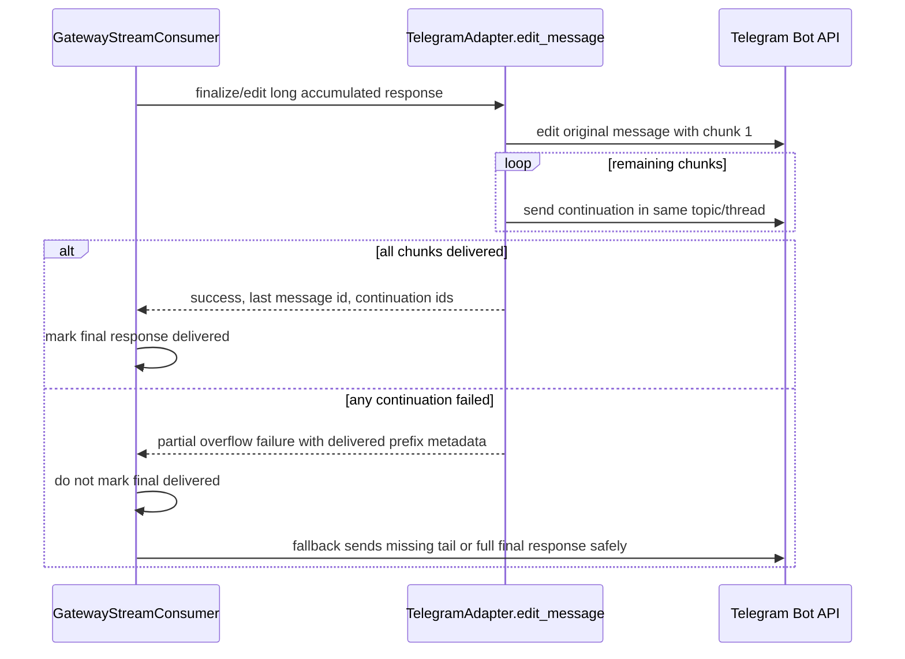

# 修复：防止 Telegram 流式回复在首个溢出数据块后中断

## 摘要

该修复针对 Telegram 网关的一个缺陷：当助手的流式回复内容过长时，会在首个溢出数据块之后看似在回答中途突然停止。报告中的截图显示，在 `Nehemiah - Coding` 这个 Telegram 主题中，Hermes 生成的较长回复在“- 可见的工具调用摘要”处结束，随后用户指出之前的消息并未完整传输到该 Telegram 主题。

此次修复的重点是处理流式编辑的溢出问题，而非一般的模型生成流程。一个完整的助手回复要么需通过所有后续消息全部传输至 Telegram，要么需留下足够的状态，以便网关的回退机制能够传递剩余内容，而不会在部分内容传输后就判定该轮对话已结束。

---

## 问题描述

Telegram 对消息文本的长度限制为 4096 个 UTF-16 编码单元。Hermes 通过编辑消息的方式来流式传输网关的响应；当流式消息的内容超过此限制时，会将溢出部分拆分为多个独立的 Telegram 消息。适配器本身已具备处理超大编辑内容的拆分与传输机制，但针对部分后续消息传输失败的错误处理机制较为薄弱：即便第一块数据成功编辑并发送，后续的继续传输失败时，适配器仍可能报告操作成功。这样一来，流式消息的接收方可能会判定最终响应已送达，但实际上主题中仅显示了第一部分内容。

在 Telegram 论坛主题中，这一问题尤为明显——较长的最终回复内容可能会被拆分到“工具处理进度”气泡之下，而缺失的后续内容则会让用户误以为回答在途中停止了。

---

## 需求规格

- R1：长格式的 Telegram 流式回复必须在所有溢出数据块中完整保留最终内容。
- R2：在首个溢出数据块发送成功后，若后续任何数据块传输失败，网关不得将最终响应标记为已完全送达。
- R3：所有后续数据块必须继续发送到与原始响应相同的 Telegram 主题/线程中。
- R4：该修复方案需确保在所有溢出数据块均成功传输时，不会重复发送完整回复。
- R5：测试用例需覆盖所报告的故障场景：即流式回复内容超过 Telegram 的限制，首次编辑成功，但后续编辑失败，且此类回复不得被视为已完成。

---

## 关键技术决策

- 将溢出数据的传输视为“全有或全无”的状态。只有当所有计划发送的数据块都成功到达 Telegram 后，`_edit_overflow_split` 才应返回最终送达成功的结果。部分传输属于另一种独立的状态，下游代码可以针对该情况进行处理。
- 除非现有结果结构无法满足需求，否则应通过 `SendResult.raw_response` 传递部分溢出数据的元数据，而非新增公共数据类字段。由于流式消息的接收方会在适配器完成编辑后检查 `SendResult`，因此采用简单的原始响应结构即可实现变更，且不会带来过大影响。
- 由流式消息的接收方负责判定最终是否已送达。适配器虽知晓哪些数据块已成功发送，但“最终响应是否已发送”、“最终内容是否已送达”、“回退前缀内容”以及回退时的最终发送逻辑，都应由接收方负责管理。
- 相关的路由逻辑仍需保留在 Telegram 适配器的辅助函数中。后续的继续发送操作应继续使用 `_thread_kwargs_for_send(...)`，并结合从元数据中获取的 `message_thread_id` 与回复锚点，以确保论坛主题中的行为保持一致。

---

## 高层技术设计

## 实现单元

### U1：为 Telegram 编辑分片添加部分溢出处理机制

**目标：** 使 `TelegramAdapter._edit_overflow_split` 能够区分完整溢出传输与部分传输情况。

**需求：** R1、R2、R4

**依赖项：** 无

**相关文件：**
- `gateway/platforms/telegram.py`
- `tests/gateway/test_telegram_send.py`，或已有用于测试 `edit_message` 溢出行为的 Telegram 适配器测试模块

**实现思路：**
- 当所有数据块均成功传输时，保持原有逻辑不变：返回 `SendResult(success=True, message_id=<最后一个数据块>, continuation_message_ids=(...))`。
- 在首次编辑后后续传输失败时，返回能明确表明为部分传输的结果，而非直接标记为成功。建议设置 `success=False`、`retryable=True`，并包含 `raw_response` 元数据，如已传输数据块数量、总数据块数量、最后已传输的消息 ID 以及已显示的已传输内容前缀。
- 保留日志记录，但不要仅依赖日志作为判断依据。调用方必须能够识别出发生了部分传输情况。
- 确保首个编辑的数据块以及所有成功传输的后续数据块仍保持现有的 Markdown/纯文本回退机制。

**需遵循的模式：**
- `TelegramAdapter.edit_message` 和 `_edit_overflow_split` 中现有的溢出处理逻辑。
- `gateway/platforms/base.py` 中现有的 `SendResult` 规范，尤其是 `retryable`、`raw_response` 和 `continuation_message_ids` 相关字段。

**测试场景：**
- 完整的超大编辑内容且所有后续传输均成功时，返回成功状态、最后一个后续传输的 ID 以及所有后续传输的 ID。
- 完整的超大编辑内容但首次后续传输失败时，返回部分溢出错误，不标记为成功。
- 完整的超大编辑内容中某个后续传输成功而后续传输失败时，在原始元数据中返回最后已传输的后续传输 ID 以及已传输数量。
- 若后续传输的 MarkdownV2 格式化失败，仍会先尝试发送纯文本，之后才视为传输失败。

**验证方式：** 通过适配器测试确保完整溢出情况仍能正常处理，且调用方能够识别出部分溢出情况。

### U2：引导流式消费者从部分溢出中恢复

**目标：** 确保除非完整响应已送达用户，否则部分 Telegram 溢出情况不会设置 `_final_response_sent` 或 `_final_content_delivered` 标志。

**需求：** R1、R2、R4、R5

**依赖项：** U1

**相关文件：**
- `gateway/stream_consumer.py`
- `tests/gateway/test_stream_consumer.py`，或专门针对 Telegram 溢出情况的新测试文件 `tests/gateway/test_stream_consumer_telegram_overflow.py`

**实现思路：**
- 在 `_send_or_edit` 方法中，当 `adapter.edit_message(...)` 返回部分溢出错误时，更新消费者状态，反映最后可见的内容前缀/消息，并对缺失内容采用回退传输方式。
- 不要将 `_already_sent` 标志视为最终交付完成。即使内容已部分显示，也不代表已完成最终交付。
- 若有 `delivered-prefix` 元数据，可使用它让 `_send_fallback_final(...)` 仅发送缺失的尾部内容。如果经过 Markdown 格式化后发现前缀信息不可靠，则建议将完整的最终响应作为新的回退消息发送，而非直接丢弃尾部内容。
- 当适配器已传输所有数据块时，仍保持原有的 `continuation_message_ids` 成功处理逻辑。

**需遵循的模式：**
- `GatewayStreamConsumer._send_or_edit` 和 `_send_fallback_final` 中现有的回退模式。
- 针对以往部分传输问题而添加的关于 `_final_response_sent`、`_final_content_delivered` 和 `_fallback_prefix` 的注释。

**测试场景：**
- 完整的流式响应因内容过大而溢出，且编辑分片传输全部成功时，设置最终交付标志，不触发回退机制。
- 完整的流式响应的适配器报告部分溢出时，不立即设置最终交付标志。
- 发生部分溢出后，回退传输会先发送剩余的尾部内容，只有当回退传输成功时才会标记最终内容已交付。
- 如果回退传输也失败，消费者仍保持最终交付标志为未完成状态，以便网关的非流式最终发送安全机制能够继续运行。

**验证方式：** 通过流式消费者测试模拟首次显示部分内容而后后续传输失败的情况，生成与截图一致的测试结果，进而确认最终结果不会被隐藏。

### U3：在溢出及回退传输中保留 Telegram 主题/线程路由信息

**目标：** 确保溢出恢复消息能够发送到相同的 Telegram 论坛主题或私信主题的回退上下文中。

**需求：** R3

**依赖项：** U1、U2

**相关文件：**
- `gateway/platforms/telegram.py`
- `gateway/stream_consumer.py`
- `tests/gateway/test_stream_consumer_thread_routing.py`
- 若相关测试已较为完善，也可参考现有的 Telegram 适配器路由测试

**实现思路：**
- 在每次溢出后续传输及回退传输中均传递 `metadata` 信息。
- 在有效的情况下保留回复锚点，但不要因为缺少回复锚点就丢失普通论坛主题的 `message_thread_id`。
- 对于私信主题的回退元数据，需保持适配器注释中规定的更为严格的锚点处理规则。

**需遵循的模式：**
- `TelegramAdapter._thread_kwargs_for_send(...)`.
- 针对 Telegram 主题恢复及流式消费者线程路由的现有测试。

**测试场景：**
- 溢出后的后续传输包含论坛主题的 `message_thread_id`。
- 在“未找到回复消息”后重新尝试传输时，若允许，则保持论坛主题的路由设置不变。
- 部分溢出后的回退传输会接收到与原始流式消费者相同的元数据。

**验证方式：** 通过线程路由相关断言，模拟虚拟机器人调用，确认所有后续/回退消息均携带预期的主题元数据。

### U4：添加问题证据及 PR 正文的可追溯性

**目标：** 使上游问题记录和 PR 正文能够清晰关联用户可见的缺陷及验证证据。

**需求：** R5

**依赖项：** U1、U2、U3

**相关文件：**
- 通过 `gh issue create` 创建的 GitHub 问题描述。
- 使用 `.github/PULL_REQUEST_TEMPLATE.md` 撰写的 PR 正文。

**实现思路：**
- 创建一个包含截图证据的 GitHub 问题：在 `Nehemiah - Coding` Telegram 主题中，长消息在“- The visible tool-call summary”处中断，且用户的回复指出之前的消息并未完整传输到该 Telegram 主题。
- 明确指出受影响的组件为 Gateway，平台为 Telegram。
- 在 PR 正文中，使用 `Fixes #...` 标识问题，描述分片传输机制的变更内容，并附上截图；若 GitHub 支持上传，也可直接附加截图。
- 严格遵循 `CONTRIBUTING.md` 及仓库的 PR 模板要求。

**需遵循的模式：**
- `.github/ISSUE_TEMPLATE/bug_report.yml`
- `.github/PULL_REQUEST_TEMPLATE.md`

**测试场景：**
- 测试预期：无，此项属于问题跟踪与 PR 文档编写工作。

**验证方式：** 确保 GitHub 问题存在且包含截图证据或明确的截图引用，同时 PR 正文中已关联问题并列出了所运行的测试。

---

## 范围界定

### 在范围内

- Telegram 流式响应的溢出分割与恢复机制。
- 针对部分溢出传输情况的流式消费者最终交付状态判定。
- 溢出及回退传输过程中主题/线程元数据的保留。
- 针对适配器及流式消费者行为的专项单元测试。

### 不在范围内

- 修改 `run_agent.py` 中的模型流式传输逻辑。
- 重新设计仅适用于私信的 Telegram 草稿流式传输功能，即截图中所示的论坛主题路径以外的传输方式。
- 修改 Discord、Slack、WhatsApp 或 Matrix 等平台的通用消息分割逻辑，除非为修复 Telegram 相关问题而需要调整共享辅助函数。
- 更改工具进度显示设置或终端中的进度渲染方式。

### 暂缓处理，待后续工作完成

- 实现针对所有消息平台的网关传输完整性更全面的监控机制。
- 提供面向用户的重新发送/恢复命令，用于恢复之前被截断的响应内容。

---

## 风险与缓解措施

- **风险：** 回退恢复机制会重复发送已显示过的初始数据块。**缓解措施：** 在可依赖的情况下使用 `delivered-prefix` 元数据，并添加测试以确保在完全成功的情况下不会发生重复内容。
- **风险：** 在保留论坛主题路由的同时处理无效的回复锚点，容易引发功能退化。**缓解措施：** 对 `message_thread_id` 及回复行为添加虚拟机器人调用相关的断言。
- **风险：** MarkdownV2 格式化可能会改变可见内容与原始内容的对比结果。**缓解措施：** 保持回退机制的保守性；优先保证内容不丢失，而非默默忽略缺失内容，但测试应始终以仅发送尾部内容为默认路径。

---

## 参考资料与研究依据

- 用户提供的截图，路径为 `/root/.hermes/image_cache/img_f664e68f6ddf.jpg`。
- `gateway/stream_consumer.py` 中关于流式编辑、溢出处理、回退机制及最终交付状态管理的实现。
- `gateway/platforms/telegram.py` 中用于 Telegram 发送/编辑操作、溢出分割及主题路由的辅助函数。
- `gateway/platforms/base.py` 中的 `SendResult` 接口定义以及通用的消息数据块分割辅助函数。
- 用于专项回归测试的 `tests/gateway/test_stream_consumer.py`、`tests/gateway/test_stream_consumer_thread_routing.py` 以及 Telegram 适配器相关测试。

---

## 验证策略

- 运行针对 Telegram 适配器溢出情况的专项测试。
- 运行针对流式消费者溢出/回退功能的专项测试。
- 运行受元数据变化影响的主题路由相关测试。
- 运行与 Telegram 发送/编辑、流式消费者以及进度显示相关的网关测试子集。
- 在创建 PR 之前，确保 `git diff` 中仅包含针对该缺陷的方案、实现代码、测试用例以及与 PR/问题相关的文档。
