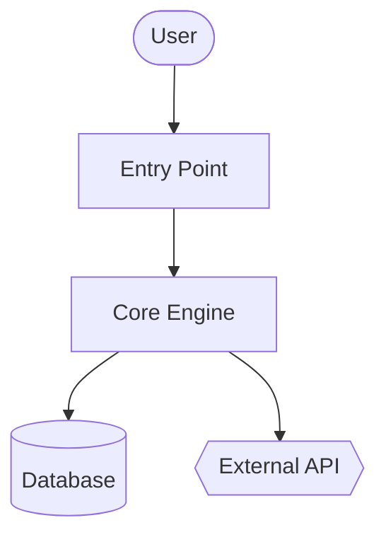
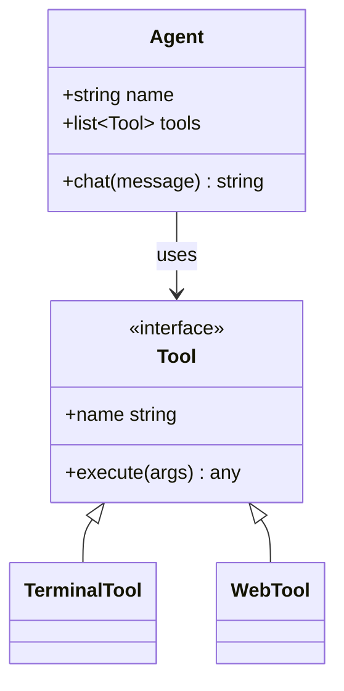
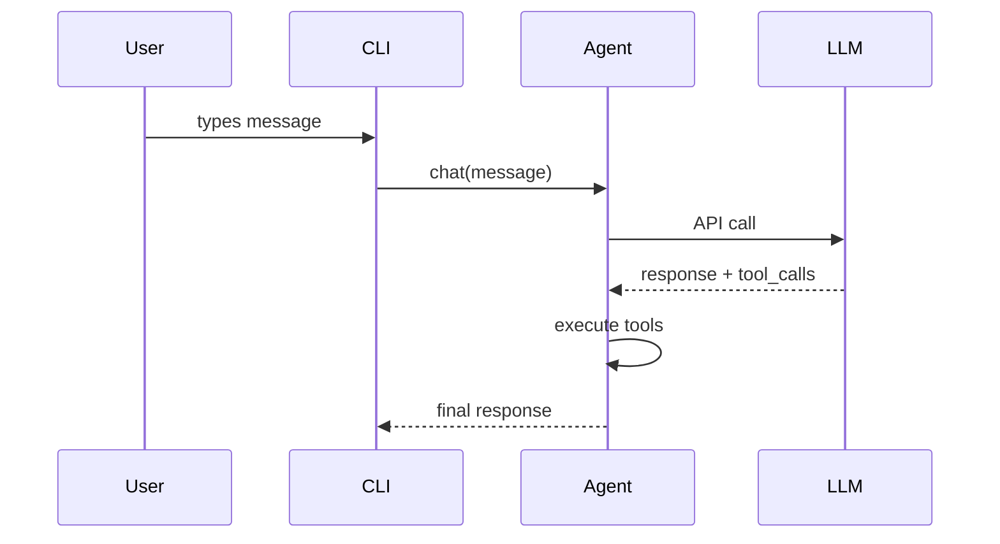

# 代码维基技能

可为任意代码库生成完整的维基文档——包括概览、架构说明、各模块的详细解析，以及 Mermaid 类图和时序图。该技能灵感源自 Google CodeWiki，但可在本地仓库、私有仓库以及支持任何编程语言的环境中使用。它仅依赖现有的 Hermes 工具（`terminal`、`read_file`、`search_files`、`write_file`），无需 Docker、外部服务或额外依赖项。

此技能用于生成**参考文档**，即说明“什么”以及“如何操作”。它不负责撰写战略层面的叙述内容，即解释“为何如此设计”——这类功能由其他技能承担。

## 适用场景

- 用户要求“为这个代码库编写文档”、“生成维基页面”或“制作架构图”
- 在接触新代码库时需要结构化的参考资料
- 用户提供 GitHub 链接并要求生成文档
- 需要可在 GitHub 上直接渲染的稳定文档格式（Markdown + Mermaid）

**不适用于以下情况：**
- 单文件或单函数的文档说明——可直接给出答案
- 某个特定 API 接口的参考文档——可使用 `read_file` 功能直接在回复中提供信息
- 战略层面的“为何存在”解释——属于其他技能的职责范畴
- 用户正在当前会话中主动开发的代码库——建议针对具体问题逐一解答

## 前提条件

- 无需环境变量。
- 系统 PATH 中需包含 `git`，以便追踪代码库的 SHA 值并克隆远程仓库。
- 可选：如需语言使用情况统计，可安装 `pygount`（参见 `codebase-inspection` 技能）。

## 使用方法

从目标仓库的根目录通过 `terminal` 工具发起调用，随后使用 `read_file` / `search_files` / `write_file` 功能来生成维基文档。默认输出路径为 `~/.hermes/wikis/<repo-name>/`。除非用户明确要求，否则仅可将内容写入仓库内的 `docs/wiki/` 目录。

## 快速参考

| 步骤 | 操作 |
|---|---|
| 1 | 确定目标路径——可以是当前工作目录、指定路径，或是通过 `git clone --depth 50 <url>` 复制到临时目录 |
| 2 | 扫描目录结构——使用 `ls`、`find -maxdepth 3`、清单文件以及 README 文件 |
| 3 | 选择 8–10 个需要文档记录的模块 |
| 4 | 编写 `README.md`（包含概述及模块映射表） |
| 5 | 使用 Mermaid 流程图编写 `architecture.md` |
| 6 | 在 `modules/` 目录下为每个模块编写文档 |
| 7 | 编写 `diagrams/class-diagram.md`（Mermaid 类图） |
| 8 | 编写 `diagrams/sequences.md`（Mermaid 序列图，描述 2–4 种工作流程） |
| 9 | 编写 `getting-started.md` |
| 10 | 如有必要，编写 `api.md`，否则跳过此步骤 |
| 11 | 编写 `.codewiki-state.json` 文件 |
| 12 | 将路径信息告知用户 |

## 操作流程

### 1. 确定目标路径

对于 GitHub 链接：

```bash
WIKI_TMP=$(mktemp -d)
git clone --depth 50 <url> "$WIKI_TMP/repo"
cd "$WIKI_TMP/repo"
REPO_SHA=$(git rev-parse HEAD)
REPO_NAME=$(basename <url> .git)
```

对于本地路径（若未指定则使用当前工作目录）：

```bash
cd <path>
REPO_SHA=$(git rev-parse HEAD 2>/dev/null || echo "uncommitted")
REPO_NAME=$(basename "$PWD")
```

接着设置输出目录：

```bash
OUTPUT_DIR="$HOME/.hermes/wikis/$REPO_NAME"
mkdir -p "$OUTPUT_DIR/modules" "$OUTPUT_DIR/diagrams"
```

### 2. 扫描仓库结构

对于Shell操作，请使用 `terminal` 工具；而对于清单文件的处理，则可使用 `read_file` 工具：

```bash
# Shallow tree first
ls -la

# Deeper tree, noise filtered
find . -type d \
  -not -path '*/\.*' \
  -not -path '*/node_modules*' \
  -not -path '*/venv*' \
  -not -path '*/__pycache__*' \
  -not -path '*/dist*' \
  -not -path '*/build*' \
  -not -path '*/target*' \
  -maxdepth 3 | sort

# Language breakdown (skip if pygount unavailable)
pygount --format=summary \
  --folders-to-skip=".git,node_modules,venv,.venv,__pycache__,.cache,dist,build,target" \
  . 2>/dev/null || true
```

接着，使用 `read_file` 功能读取相关的清单文件（如 `package.json`、`pyproject.toml`、`setup.py`、`Cargo.toml`、`go.mod`、`pom.xml`、`build.gradle`）以及项目中的 README 文件。建议使用 `search_files target='files'` 来定位这些文件，而非凭猜测来指定名称。

### 3. 确定需要文档化的模块

首次文档化工作时，建议将范围控制在 **8–10 个模块**。不同语言的模块选择策略如下：

- Python：顶层包（包含 `__init__.py` 的目录）以及子系统目录
- JS/TS：`src/<subdir>` 目录及顶层工作区目录
- Rust：工作区中的每个 crate，或顶层的 `src/<module>` 目录
- Go：每个顶层包目录
- 混合类型/不熟悉的代码库：包含源代码的顶层目录（排除配置文件和测试文件）

对于规模极大的代码库，可按以下优先级进行筛选：
1. 被导入的次数（被大量模块引用的模块属于核心模块）
2. 代码行数（代码量较大的模块通常需要单独编写文档）
3. README 文件或顶层文档中的提及频率

在为大型代码库生成单个模块的文档之前，应先向用户说明拟文档化的模块列表——这样用户就有机会提出调整建议。

### 4. 编写 `README.md` 文件

使用 `read_file` 功能读取实际的项目 README 文件以及最顶层的 2–3 个入口文件。之后再使用 `write_file` 功能来生成文档：

````markdown
# <Project Name>

<One paragraph: what it is and what it's for. Self-contained — don't assume the
reader has the source README.>

## Key Concepts

- **<Concept 1>** — <one line>
- **<Concept 2>** — <one line>

## Entry Points

- [`path/to/main.py`](<link>) — <what runs when you start it>
- [`path/to/cli.py`](<link>) — <CLI surface>

## High-Level Architecture

<2-3 sentences. Detail goes in architecture.md.>

See [architecture.md](architecture.md).

## Module Map

| Module | Purpose |
|---|---|
| [`<module>`](modules/<module>.md) | <one-line purpose> |

## Getting Started

See [getting-started.md](getting-started.md).
````

在本地模式下，链接目标应使用相对路径；而对于克隆的仓库，则需使用 `https://github.com/<owner>/<repo>/blob/<sha>/<path>` 这一格式，这样才能确保链接在后续的提交中依然有效。

### 5. 编写 `architecture.md` 文件

````markdown
# Architecture

<2-3 paragraphs: shape of the system. What talks to what. Where data enters,
where it exits, where state lives.>

## Components

- **<Component>** — <1-2 sentences>. See [`modules/<module>.md`](modules/<module>.md).

## System Diagram



## Data Flow

1. **<Step>** — [`<file>`](<link>)
2. **<Step>** — [`<file>`](<link>)

## Key Design Decisions

- <Anything load-bearing the reader should know>
````

**Mermaid 图形元素含义：**
- `[]` = 组件
- `[()]` = 数据库/存储系统
- `{{}}` = 外部服务
- `(())` = 入口点或终端
- `-->` = 同步调用，`-.->` = 异步/事件驱动

每个图表中的节点数量建议控制在20个左右。若节点过多，则需拆分为多个子图表。

### 6. 在 `modules/` 目录中为每个模块编写文档

针对选定的每个模块，先使用 `ls` 命令查看其目录结构，找出3–5个最重要的文件（可根据文件大小、是否命名为 `core.py` / `main.py` / `__init__.py`，或是被频繁导入等标准来判断），随后使用 `read_file` 函数读取这些文件（建议使用 `offset` / `limit` 参数仅读取所需内容；若需查找特定符号，则推荐使用 `search_files` 函数）。

````markdown
# Module: `<module>`

<1-2 sentence purpose.>

## Responsibilities

- <bullet>
- <bullet>

## Key Files

- [`<module>/<file>`](<link>) — <what it does>

## Public API

<Functions/classes/constants other code uses. Group related items. Show
signatures, not full implementations.>

## Internal Structure

<How the module is organized internally. State management.>

## Dependencies

- **Used by:** <other modules>
- **Uses:** <other modules + external libs>

## Notable Patterns / Gotchas

- <Anything non-obvious>
````

### 7. 编写 `diagrams/class-diagram.md` 文件

先挑选出 5 到 10 个最重要的类或类型，使用 `read_file` 功能读取相关信息，随后进行编写：

````markdown
# Class Diagram

## Core Types



## Notes

<Anything the diagram can't express — lifecycle, threading, etc.>
````

对于没有类的语言（如 Go、C、Rust）：可使用结构体关系图，或者跳过 class-diagram.md，而在 architecture.md 中用文字进行说明。无需强行套用类图格式。

### 8. 编写 `diagrams/sequences.md` 文件

挑选 2–4 个最重要的工作流程。通过代码追踪每条调用路径（从入口点开始，依次跟随函数调用），然后：

````markdown
# Sequence Diagrams

## Workflow: <Name>

<1 sentence describing what this does and when it runs.>



### Walkthrough

1. **User input** — [`cli.py:HermesCLI.run_session`](<link>)
2. **Message dispatch** — [`run_agent.py:AIAgent.chat`](<link>)
````

切勿虚构相关组件。每一个方框都必须对应读者在代码中能够找到的真实元素。

### 9. 编写 `getting-started.md` 文件

````markdown
# Getting Started

## Prerequisites

<From manifest files + README. Be specific — versions if pinned.>

## Installation

```bash
<exact commands>
```

## First Run

```bash
<minimum command to see the system do something useful>
```

## Common Workflows

### <Workflow 1>
<commands>

## Configuration

- `<config-file>` — <what it controls>
- Env var `<VAR>` — <what it controls>

## Where to Go Next

- Architecture: [architecture.md](architecture.md)
- Module reference: [README.md#module-map](README.md#module-map)
````

### 10. 编写 `api.md` 文件（如不适用则跳过）

仅当项目为库或 API 服务器时才需要编写此文件。具体步骤如下：

- 确定公共 API 接口（通过 `__init__.py` 中导出的内容、OpenAPI 规范、路由处理函数以及导出的类型来识别）；
- 为每个公共接口记录其签名、参数、返回类型以及简短说明；
- 按类别对相关接口进行归类。

### 11. 编写状态文件

```bash
cat > "$OUTPUT_DIR/.codewiki-state.json" <<EOF
{
  "repo_name": "$REPO_NAME",
  "source_path": "$PWD",
  "source_sha": "$REPO_SHA",
  "generated_at": "$(date -u +%Y-%m-%dT%H:%M:%SZ)",
  "generator": "hermes-agent code-wiki skill v0.1.0",
  "modules_documented": []
}
EOF
```

### 12. 向用户报告结果

需明确说明生成了什么内容以及其所在位置：

```
Generated wiki at ~/.hermes/wikis/<repo-name>/:
  README.md                   project overview, module map
  architecture.md             system architecture + flowchart
  getting-started.md          setup, first run, workflows
  modules/<N files>           per-module deep-dives
  diagrams/architecture.md    Mermaid flowchart
  diagrams/class-diagram.md   Mermaid class diagram
  diagrams/sequences.md       Mermaid sequence diagrams
```

如果用户将代码克隆到了临时目录中，请提醒其在查看完维基内容后可以将其删除（使用命令 `rm -rf "$WIKI_TMP"`）。

## 范围控制

为包含 50 万行代码的单体仓库生成完整维基文档会耗费大量令牌。建议默认采用受限范围：

- 初始扫描：最大深度为 3 个目录
- 模块级文档：默认限制为 10 个模块，除非用户主动扩大范围
- 文件读取：优先使用 `search_files` 查找符号，或结合 `offset`/`limit` 参数使用 `read_file`，而非直接读取整个文件
- 跳过第三方代码（如 `vendor/`、`third_party/` 目录中的内容、生成的代码以及 `_pb2.py`、`.min.js` 等文件）

如果用户坚持要求“全面覆盖所有内容”，请先估算成本后再照做，例如：“该仓库约有 340 个源文件，进行全面生成会非常耗资源——您确认要继续吗？”

## 重新运行/更新

如果目标路径已存在 `.codewiki-state.json` 文件：

- 读取该文件以获取之前的 SHA 值和模块列表
- 若源代码的 SHA 值相同，则询问用户是选择重新生成还是跳过此步骤
- 若 SHA 值不同，则建议仅针对有变更的文件重新生成（可通过命令 `git diff --name-only <old-sha> HEAD` 查看变更文件）

完全的增量式重新生成功能是未来的改进方向——目前直接重新生成整个文档也是可行的。

## 常见问题

- **编造组件内容**。源文件中必须包含每个图表节点以及所声明的函数调用。在写入内容前应先使用 `read_file` 函数读取数据。自动生成文档时最常见的问题，就是出现看似合理实则编造的内容。
- **空洞的通用AI式表述**。“该模块负责……”这类说法毫无实质信息。应使用特定领域的专业术语来描述模块的实际功能。
- **将代码描述转化为冗长文字**。如果模块文档只是写道“`process`函数通过逐个调用`process_item`来处理数据”，这比直接链接到该函数还要糟糕。
- **Mermaid图表节点超过50个**。此时图表将无法清晰显示，需将其拆分。
- **将测试代码、生成的代码或第三方依赖项当作产品代码来编写文档**。此类内容应省略不写。
- **未经允许就在仓库内生成输出文件**。默认存储路径为 `~/.hermes/wikis/`。只有在用户明确要求时，才可将内容写入仓库。
- **Mermaid特殊字符需用引号包裹**：正确格式为 `A["工具/智能体"]`，而非 `A[工具/智能体]`。若需在节点内换行，可使用 `<br>` 标签。
- **SKILL.md文件中不能使用嵌套代码块**。当在Markdown示例中嵌入Mermaid图表时，应使用4个反引号作为外部代码块，这样内部3个反引号构成的 ` ```mermaid ``` 才不会关闭外部代码块。（此SKILL.md文件采用了正确格式。）
- **classDiagram中的泛型符号**会显示为 `~T~` 的形式（例如 `List~工具~`），而非 `<T>`。
- **GitHub平台的Mermaid主题是固定不变的**——切勿使用 `%%{init: ...}%%` 这类代码块，因为它们在渲染时会被删除。

## 验证步骤

编写完成后，请进行以下验证：

1. **检查Mermaid代码块的平衡性**——每个文件中打开的代码块数量与关闭的数量必须相等。
   ```bash
   for f in "$OUTPUT_DIR"/diagrams/*.md "$OUTPUT_DIR"/architecture.md; do
     opens=$(grep -c '^```mermaid' "$f")
     total=$(grep -c '^```' "$f")
     echo "$f: $opens mermaid blocks, $total total fences (expect total = opens*2)"
   done
   ```
2. **所有预期文件均存在** —
   ```bash
   ls "$OUTPUT_DIR"/{README.md,architecture.md,getting-started.md,.codewiki-state.json} \
      "$OUTPUT_DIR"/modules/ "$OUTPUT_DIR"/diagrams/
   ```
3. **模块数量与预期一致** — 执行命令 `ls "$OUTPUT_DIR/modules" | wc -l` 得出的数值，应与您在步骤3中提交的模块数量相同。  
4. **不存在虚构路径** — 需验证2–3个源文件链接确实指向真实的文件。
