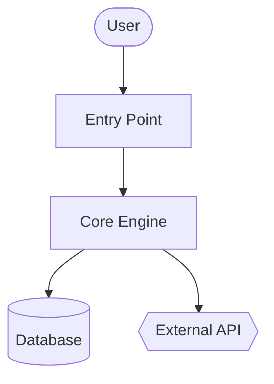

# 架构

{{TWO_TO_THREE_PARAGRAPHS_SHAPE_OF_SYSTEM}}

## 组件

- **{{COMPONENT_1}}** — {{ONE_TO_TWO_SENTENCES}} 详情请参阅 [`modules/{{MODULE}}.md`](modules/{{MODULE}}.md)。
- **{{COMPONENT_2}}** — {{ONE_TO_TWO_SENTENCES}}

## 系统架构图

## 数据流

1. **{{STEP_1}}** — [`{{FILE}}`]({{LINK}})
2. **{{STEP_2}}** — [`{{FILE}}`]({{LINK}})
3. **{{STEP_3}}** — [`{{FILE}}`]({{LINK}})

## 关键设计决策

- {{DECISION_1}}
- {{DECISION_2}}
- {{DECISION_3}}
