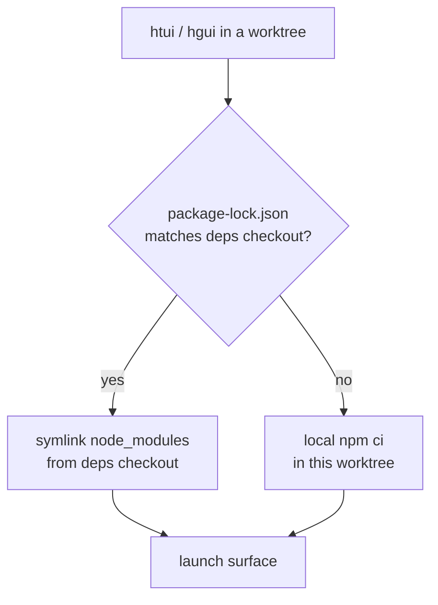

# Worktrees环境下的TUI与桌面应用

Python核心代码在任何[git worktree](../user-guide/git-worktrees.md)环境中都能正常运行——只需进入对应目录后直接调用`hermes`即可。但基于TypeScript开发的两个界面则不然：`ui-tui/`和`apps/desktop/`这两个项目都需要完整的`node_modules`环境，而每次在新的worktree中执行`npm ci`不仅效率低下，还会在你检出的每个分支中重复生成数GB的冗余包文件。

`htui`与`hgui`正是为解决这一问题而设计的两个Shell辅助工具。它们均从当前worktree启动界面，同时从某个标准版本的分支中借用`node_modules`资源——因此创建临时分支仅需建立符号链接，无需进行实际安装。

这些工具仅为开发者提供便利，并非正式发布的命令。你可将其添加到`~/.zshrc`文件中，根据个人需求调整路径设置。

## 依赖共享机制

只有一个版本的分支是**依赖安装分支**——即真正执行`npm install`操作的地方。所有其他worktree都会引用这个分支的依赖，只有当各自的锁定文件出现差异时，才会重新在本地安装依赖（避免因依赖版本升级而使用过时的包文件）。



有两个环境变量用于指定标准的依赖下载路径：

| 变量 | 含义 |
|------|------|
| `HERMES_MAIN_CHECKOUT` | 依赖项的下载路径——即 `node_modules` 所在的位置，后端程序也在此处的 `.venv/bin/python` 中运行。 |
| `HERMES_GUI_DEPS_CHECKOUT` | 桌面应用依赖项（位于 `apps/desktop/node_modules`）的存储位置。默认值为 `HERMES_MAIN_CHECKOUT`；仅当您将桌面依赖项存储在其他位置时才需进行覆盖设置。 |

Hermes 本身并不会读取这两个变量——它们仅供相关辅助工具使用。Hermes 实际会读取的环境变量内容详见 [环境变量](../reference/environment-variables.md) 文档。

## `htui` — 来自工作目录的 TUI 工具

Ink TUI 已经提供了开发模式：通过 `hermes --tui --dev` 可以使用 `tsx` 编译 TypeScript 源码，而非直接加载预编译的代码包。`htui` 则是针对该功能的简化命令，它会将运行路径指向当前工作目录下的 `ui-tui/` 文件夹：

```bash
htui() {
  local root
  root="$(_hermes_root)" || { echo "htui: not in a Hermes checkout" >&2; return 1; }
  ( cd "$root" && PYTHONPATH="$root" \
      "$HERMES_MAIN_CHECKOUT/.venv/bin/python" -m hermes_cli.main --tui --dev "$@" )
}
```

`--dev` 模式会从源代码进行编译；当根目录的锁文件匹配时，它会链接 `HERMES_MAIN_CHECKOUT` 中的 `ui-tui/node_modules`，否则则进行本地安装（详见 [`_hermes_root` / 链接辅助函数](#shared-helpers)）。

:::warning `--dev` 模式与 `HERMES_TUI_DIR` 是互斥的
`HERMES_TUI_DIR` 用于指定 Hermes 使用*预构建*的包（如 Nix 或系统包），这类包没有源代码，因此无法实现热重载功能。如果在Shell环境中设置了该变量，执行 `hermes --tui --dev` 时会报错并终止。请在运行 `htui` 之前先执行 `unset HERMES_TUI_DIR`。
:::

## `hgui` — 来自工作区的桌面应用

该桌面应用体积较大：它需要在仓库根目录和 `apps/desktop/` 目录下都存在 `node_modules`，还需要一个绑定在端口 `5174` 的 Vite 开发服务器，以及一个 Python 后端。`hgui` 会将所有这些组件与当前的工作区关联起来：

```bash
hgui() {
  local root deps desktop
  root="$(_hermes_root)" || { echo "hgui: not in a Hermes checkout" >&2; return 1; }
  deps="${HERMES_GUI_DEPS_CHECKOUT:-$HERMES_MAIN_CHECKOUT}"
  desktop="$root/apps/desktop"

  # Borrow deps when locks match; otherwise install locally in the worktree.
  if cmp -s "$root/package-lock.json" "$deps/package-lock.json"; then
    _hermes_link_deps "$desktop" "$deps/apps/desktop"
    _hermes_link_deps "$root" "$deps"
  else
    ( cd "$root" && npm ci ) || return 1
  fi

  # Vite is fixed at 5174 — evict a stale session from another hgui.
  lsof -t -i:5174 >/dev/null 2>&1 && killport 5174

  # Electron often survives Ctrl+C without reaping its ephemeral backends.
  trap '_hermes_gui_cleanup "$root"' INT TERM EXIT

  ( cd "$desktop"
    export PATH="$root/node_modules/.bin:$PATH"
    HERMES_DESKTOP_HERMES_ROOT="$root" \
    HERMES_DESKTOP_PYTHON="$HERMES_MAIN_CHECKOUT/.venv/bin/python" \
    HERMES_DESKTOP_IGNORE_EXISTING=1 \
    HERMES_DESKTOP_CWD="$root" \
    npm run dev )
}
```

它所设置的桌面环境变量均为真正的后端配置参数：

| 变量名 | 在 `hgui` 中的作用 |
|--------|------------------|
| `HERMES_DESKTOP_HERMES_ROOT` | 从**当前工作目录**运行后端，而非通过打包后的/PATH 中的 `hermes` 运行。 |
| `HERMES_DESKTOP_PYTHON` | 重用已检出的依赖项对应的虚拟环境，而无需重新安装 Python。 |
| `HERMES_DESKTOP_IGNORE_EXISTING` | 忽略 PATH 中已存在的 `hermes`，避免其与当前工作目录中的版本产生冲突。 |
| `HERMES_DESKTOP_CWD` | 以当前工作目录为根路径打开桌面端聊天界面。 |

相比单纯的 `npm run dev`，`hgui` 还处理了两个关键问题：

- **端口 `5174` 固定**：若同时运行多个 `hgui` 实例，其 Vite 服务器之间会发生冲突；此时辅助进程会优先终止旧实例。
- **孤立子进程问题**：通过 `concurrently` 启动时，Electron 进程常常能在接收到 `Ctrl+C` 信号后继续运行，而不会自动终止临时的 `dashboard --port 0` 后端或 Vite 进程。为此，`EXIT`/`INT`/`TERM` 信号捕获机制会触发清理操作，终止 Electron 壳层、端口 `:5174` 的监听器以及该进程所创建的任何 `--port 0` 格式的仪表板。

## 共享辅助函数

这两个函数均以相同方式定位所在的工作目录并链接依赖项：

```bash
# The enclosing worktree, verified as a real Hermes checkout.
_hermes_root() {
  local root
  root="$(git rev-parse --show-toplevel 2>/dev/null)" || return 1
  [[ -f "$root/hermes_cli/main.py" && -d "$root/ui-tui" ]] && print -r "$root"
}

# Symlink node_modules from the deps checkout — never over an existing tree.
_hermes_link_deps() {
  local target="${1%/}" source="${2%/}"
  [[ -d "$source/node_modules" ]] || return 1
  [[ -e "$target/node_modules" ]] || ln -s "$source/node_modules" "$target/node_modules"
}

# Reap ephemeral backends Electron leaves behind on exit.
_hermes_gui_cleanup() {
  local root="$1"
  [[ -n "$root" ]] && pkill -TERM -f "${root}/apps/desktop/node_modules/electron" 2>/dev/null
  lsof -t -i:5174 >/dev/null 2>&1 && killport 5174
  pgrep -f 'hermes_cli\.main.*dashboard.*--port 0' 2>/dev/null | xargs -r kill -TERM 2>/dev/null
}
```

`killport`是一个可供自行使用的简单辅助工具（实现方式：`lsof -ti:$1 | xargs kill`）；您可以根据需求替换为其他命令。

:::info 为何仅在锁文件内容一致时才创建符号链接
如果符号链接指向的`node_modules`目录与实际不一致，其后果甚至比未安装还要糟糕——工作区将会基于锁文件中未记录的包进行构建。通过逐字节比对`package-lock.json`是一种高效且精确的验证方式：锁文件内容相同则可安全地借用；若锁文件不同，则需在本地执行`npm ci`命令。Vite会在应用`server.fs.allow`规则生效之前先创建真实路径符号链接，正因如此，《apps/desktop/vite.config.ts`文件才会将真实的`node_modules`路径加入白名单。
:::

## 相关内容

- [Git工作区](../user-guide/git-worktrees.md) —— 这些辅助工具所依赖的隔离机制
- [TUI界面](../user-guide/tui.md) —— `hermes --tui --dev`命令以及`HERMES_TUI_DIR`预构建路径
- [桌面应用](../user-guide/desktop.md) —— 源码编译流程及后端解析机制
- [`apps/desktop/README.md`](https://github.com/NousResearch/hermes-agent/blob/main/apps/desktop/README.md) —— 开发服务器、沙箱脚本及打包相关说明
- [环境变量](../reference/environment-variables.md) —— Hermes会读取的所有`HERMES_*`格式的环境变量
