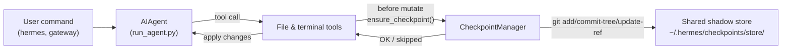

# 检查点与 `/rollback` 功能

Hermes Agent 能在执行**具有破坏性的操作**之前自动为你的项目创建快照，并通过一条命令即可将其恢复。从 v2 版本起，检查点功能为**可选**——大多数用户并不会使用 `/rollback` 命令，且随着时间推移，影子存储的体积也会逐渐增大，因此默认情况下该功能是关闭的。

如需为每个会话启用检查点功能，可使用 `--checkpoints` 参数：

```bash
hermes chat --checkpoints
```

或者可在 `~/.hermes/config.yaml` 中进行全局启用：

```yaml
checkpoints:
  enabled: true
```

这一安全机制由内置的**检查点管理器**驱动，它会在`~/.hermes/checkpoints/store/`目录下维护一个共享的影子Git仓库——您的实际项目`.git`文件绝不会被修改。Agent处理的每个项目都会使用同一个仓库，因此Git的内容寻址对象数据库能够实现跨项目和跨轮次的数据去重。

## 何时会生成检查点

在以下操作执行前，系统会自动创建检查点：

- **文件操作工具**——`write_file`和`patch`
- **具有破坏性的终端命令**——`rm`、`rmdir`、`cp`、`install`、`mv`、`sed -i`、`truncate`、`dd`、`shred`，以及输出重定向操作（`>`），还有`git reset`/`clean`/`checkout`

Agent每轮最多为每个目录创建一个检查点，从而避免长时间运行的会话产生大量冗余快照。

## 快速参考

会话中的斜杠命令：

| 命令 | 说明 |
|------|------|
| `/rollback` | 列出所有检查点及其修改统计信息 |
| `/rollback <N>` | 恢复到第N个检查点，同时保留您手动进行的编辑（也会撤销上一轮对话的更改） |
| `/rollback <N> --all` | 完全恢复——会覆盖您手动编辑的内容 |
| `/rollback diff <N>` | 预览第N个检查点与当前状态之间的差异 |
| `/rollback <N> <file>` | 从第N个检查点恢复单个文件 |

用于在会话之外查看和管理该仓库的CLI命令：

| 命令 | 描述 |
|---------|-------------|
| `hermes checkpoints` | 显示总大小、项目数量以及各项目的详细分布情况 |
| `hermes checkpoints status` | 功能与直接执行 `checkpoints` 相同 |
| `hermes checkpoints list` | 为 `status` 命令提供的别名 |
| `hermes checkpoints prune` | 强制进行清理：删除孤立或过时的文件，执行垃圾回收，并强制限制大小上限 |
| `hermes checkpoints clear` | 彻底清除所有检查点数据（会先提示用户确认） |
| `hermes checkpoints clear-legacy` | 仅删除来自 v1 迁移版本的 `legacy-*` 类型存档 |

## 检查点的工作原理

简而言之：

- Hermes 会监测工具何时试图**修改**工作目录中的文件。
- 在每次对话轮次（即每个目录）中，它会：
  - 为该文件确定一个合理的项目根目录。
  - 初始化或重用位于 `~/.hermes/checkpoints/store/` 的**单一共享影子存储空间**。
  - 将相关数据暂存到各项目的索引中，构建文件结构，然后将其提交到对应项目的引用路径（`refs/hermes/<project-hash>`）中。
- 这些针对各个项目生成的引用构成了检查点历史记录，您可以通过 `/rollback` 命令查看或恢复这些历史状态。



## 配置

在 `~/.hermes/config.yaml` 文件中进行配置：

```yaml
checkpoints:
  enabled: false              # master switch (default: false — opt-in)
  max_snapshots: 20           # max checkpoints per project (enforced via ref rewrite + gc)
  max_total_size_mb: 500      # hard cap on total store size; oldest commits dropped
  max_file_size_mb: 10        # skip any single file larger than this

  # Auto-maintenance (on by default): sweep ~/.hermes/checkpoints/ at startup
  # and delete project entries whose last_touch is older than retention_days.
  # Runs at most once per min_interval_hours, tracked via a .last_prune
  # marker. This sweep never deletes "orphan" entries (working directory not
  # found) — a missing workdir at startup is ambiguous (deleted project vs.
  # an unmounted external volume / network share / VPN not yet up), so
  # orphan cleanup is only ever done via the explicit
  # `hermes checkpoints prune` command below, with a confirmation prompt.
  auto_prune: true
  retention_days: 7
  min_interval_hours: 24
```

如需禁用所有功能：

```yaml
checkpoints:
  enabled: false
  auto_prune: false
```

当 `enabled: false` 时，Checkpoint Manager 将处于无操作状态，不会尝试执行任何 Git 操作。而当 `auto_prune: false` 时，存储空间会持续扩大，直到您手动运行 `hermes checkpoints prune` 命令为止。

## 列出检查点

在 CLI 会话中：

```
/rollback
```

Hermes 会以格式化的列表形式返回变更统计信息：

```text
📸 Checkpoints for /path/to/project:

  1. 4270a8c  2026-03-16 04:36  before patch  (1 file, +1/-0)
  2. eaf4c1f  2026-03-16 04:35  before write_file
  3. b3f9d2e  2026-03-16 04:34  before terminal: sed -i s/old/new/ config.py  (1 file, +1/-1)

  /rollback <N>             restore to checkpoint N (keeps your hand-edits)
  /rollback <N> --all       full restore, overwriting your hand-edits too
  /rollback diff <N>        preview changes since checkpoint N
  /rollback <N> <file>      restore a single file from checkpoint N
```

## 通过命令行查看商店状态

```bash
hermes checkpoints
```

示例输出：

```text
Checkpoint base: /home/you/.hermes/checkpoints
Total size:      142.3 MB
  store/         138.1 MB
  legacy-*       4.2 MB
Projects:        12

  WORKDIR                                                       COMMITS    LAST TOUCH  STATE
  /home/you/code/hermes-agent                                        20       2h ago  live
  /home/you/code/experiments/rl-runner                                8       1d ago  live
  /home/you/code/old-prototype                                        3       9d ago  orphan
  ...

Legacy archives (1):
  legacy-20260506-050616                           4.2 MB

Clear with: hermes checkpoints clear-legacy
```

强制执行全面扫描（忽略24小时幂等性标记）：

```bash
hermes checkpoints prune --retention-days 3 --max-size-mb 200
```

## 使用 `/rollback diff` 预览变更内容

在正式执行恢复操作之前，可先预览自某个检查点以来所发生的所有变更：

```
/rollback diff 1
```

此处首先显示 git diff 的统计摘要，随后才是实际的差异内容。

## 使用 `/rollback` 进行恢复

```
/rollback 1
```

在幕后，Hermes会执行以下操作：

1. 核实目标提交确实存在于影子存储中。
2. 生成当前状态的**回滚前快照**，以便日后能够“撤销撤销操作”。
3. 恢复工作目录中已被跟踪的文件——同时**保留用户手动修改的内容**（详见下文）。
4. **撤销上一次对话轮次**，从而使智能体的上下文与恢复后的文件系统状态保持一致。

### 用户手动修改的内容默认会被保留

使用`/rollback <N>`命令仅会恢复Hermes本身修改过的文件。每次成功的`write_file`/`patch`操作都会将文件内容哈希值记录到**智能体写入日志**中；在恢复时，那些当前内容已与Hermes上次写入的内容不一致的文件（即用户之后进行了修改，或Hermes从未触碰过的文件）将会被**跳过而不会被覆盖**，并且会在输出结果中列出这些文件。

```
✅ Restored to checkpoint a1b2c3d4: before write_file
↷ Kept your hand-edits: src/config.py, notes.md
Use /rollback <N> --all to restore those too.
```

若要强制执行完整恢复操作，将所有内容（包括您所做的修改）都恢复到初始状态，请添加 `--all` 参数：

```
/rollback 1 --all
```

如果账本为空（即在该功能启用之前创建的存储空间，或是Hermes尚未向该项目写入任何文件），则`/rollback`命令会自动退化为完整恢复模式。

## 单文件恢复

从检查点中仅恢复单个文件，而不会影响目录中的其他文件：

```
/rollback 1 src/broken_file.py
```

## 安全与性能防护机制

- **Git 工具可用性**——若 `PATH` 环境变量中不存在 `git`，则会自动禁用快照功能。
- **目录范围限制**——Hermes 会跳过过于宽泛的目录（如根目录 `/` 和用户主目录 `$HOME`）。
- **仓库大小限制**——文件数量超过 50,000 个的目录将被忽略。
- **单文件大小上限**——大小超过 `max_file_size_mb`（默认为 10 MB）的文件不会被纳入快照，从而避免意外存储大量数据集、模型权重或生成的媒体文件。
- **总存储空间上限**——当存储空间超过 `max_total_size_mb`（默认为 500 MB）时，系统会按轮询方式删除每个项目中最旧的提交记录，直至空间恢复在限定范围内。
- **实时清理机制**——通过重写每个项目的引用文件并随后执行 `git gc --prune=now` 命令来强制执行 `max_snapshots` 限制，防止无用对象不断累积。
- **无变更时跳过快照**——若自上次快照创建以来没有发生任何变化，则该次快照生成会被跳过。
- **非致命错误处理**——快照管理器内部出现的所有错误都会以调试级别记录，确保相关工具能够继续正常运行。

## 快照的存储位置

```text
~/.hermes/checkpoints/
  ├── store/                 # single shared bare git repo
  │   ├── HEAD, objects/     # git internals (shared across projects)
  │   ├── refs/hermes/<hash> # per-project branch tip
  │   ├── indexes/<hash>     # per-project git index
  │   ├── projects/<hash>.json  # workdir + created_at + last_touch
  │   └── info/exclude
  ├── .last_prune            # auto-prune idempotency marker
  └── legacy-<ts>/           # archived pre-v2 per-project shadow repos
```

每个 `<hash>` 值均源自工作目录的绝对路径。通常情况下您无需手动修改这些值——建议使用 `hermes checkpoints status`、`prune` 或 `clear` 命令来操作。

### 从 v1 版本迁移

在 v2 版本重写之前，每个工作目录都会在 `~/.hermes/checkpoints/<hash>/` 下拥有一个独立的完整影子 Git 仓库。这种架构无法实现跨项目的数据去重，且其内置的清理工具实际上毫无作用——导致存储空间会无限制地增长。

在首次运行 v2 版本时，所有旧版本的影子仓库都会被移至 `~/.hermes/checkpoints/legacy-<timestamp>/` 目录中，从而让新的单存储架构在干净的状态下启动。您仍然可以通过使用 `git` 手动查看旧版归档文件来获取之前的 `/rollback` 回滚记录；一旦确认不再需要这些记录，即可执行相应命令进行清理：

```bash
hermes checkpoints clear-legacy
```

为释放空间，过期的归档文件也会在达到 `retention_days` 设置的时间后被 `auto_prune` 功能自动清理。

## 最佳实践

- **仅在需要时启用检查点** — 通过 `hermes chat --checkpoints` 命令启用，或为每个配置文件设置 `enabled: true`。
- **在恢复之前使用 `/rollback diff` 命令** — 预览即将发生的变更，从而选择合适的检查点。
- **若仅需撤销智能体带来的修改，请使用 `/rollback` 而非 `git reset`**。
- **如果经常使用检查点，建议定期查看 `hermes checkpoints status`** — 该命令可显示哪些项目处于活跃状态，以及存储这些检查点会带来多少成本。
- **为确保最高安全性，可将检查点与 Git 工作树结合使用** — 将每个 Hermes 会话单独保存在对应的工作树/分支中，再以检查点作为额外的保护层。

关于在同一代码库中并行运行多个智能体的方法，请参阅 [Git 工作树](./git-worktrees.md) 的相关指南。
