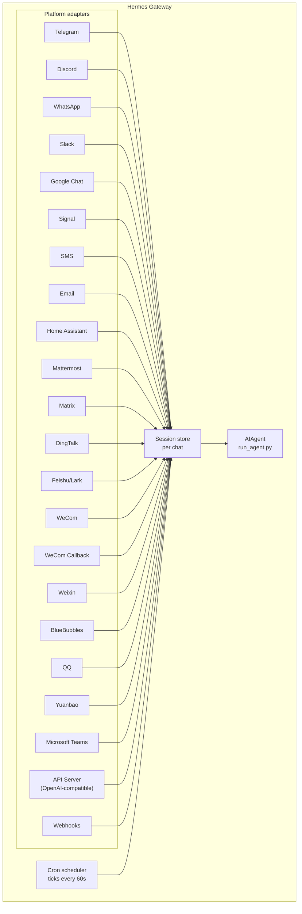

# 消息网关

您可以通过 Telegram、Discord、Slack、WhatsApp、Signal、短信、电子邮件、Home Assistant、Mattermost、Matrix、钉钉、飞书/企业微信、企业微信回调、微信、BlueBubbles（iMessage）、QQ、元宝、Microsoft Teams、LINE、ntfy 或浏览器与 Hermes 进行聊天。该网关作为一个后台进程，可连接所有已配置的平台，管理会话、执行定时任务，并传输语音消息。

如需了解完整的语音功能集——包括 CLI 麦克风模式、消息中的语音回复以及 Discord 语音频道对话功能，请参阅 [语音模式](/user-guide/features/voice-mode) 和 [在 Hermes 中使用语音模式](/guides/use-voice-mode-with-hermes)。

:::提示
机器人需要模型提供方以及工具提供方（文本转语音、网页接口）。[Nous Portal](/integrations/nous-portal) 订阅套餐可同时提供这些功能。
:::

## 平台功能对比

| 平台 | 语音功能 | 图片功能 | 文件功能 | 线程对话 | 表情反应 | 输入中状态 | 流式更新 |
|------|:-------:|:-------:|:-------:|:-------:|:---------:|:--------:|:-------:|
| Telegram | ✅ | ✅ | ✅ | ✅ | — | ✅ | ✅ |
| Discord | ✅ | ✅ | ✅ | ✅ | ✅ | ✅ | ✅ |
| Slack | ✅ | ✅ | ✅ | ✅ | ✅ | ✅ | ✅ |
| Google Chat | — | ✅ | ✅ | ✅ | — | ✅ | — |
| WhatsApp | — | ✅ | ✅ | — | — | ✅ | ✅ |
| Signal | — | ✅ | ✅ | — | — | ✅ | ✅ |
| 短信 | — | — | — | — | — | — | — |
| 电子邮件 | — | ✅ | ✅ | ✅ | — | — | — |
| Home Assistant | — | — | — | — | — | — | — |
| Mattermost | ✅ | ✅ | ✅ | ✅ | — | ✅ | ✅ |
| Matrix | ✅ | ✅ | ✅ | ✅ | ✅ | ✅ | ✅ |
| 钉钉 | — | ✅ | ✅ | — | ✅ | — | ✅ |
| 飞书/企业微信 | ✅ | ✅ | ✅ | ✅ | ✅ | ✅ | ✅ |
| 企业微信回调 | — | — | — | — | — | — | — |
| 微信 | ✅ | ✅ | ✅ | — | — | ✅ | ✅ |
| BlueBubbles | — | ✅ | ✅ | — | ✅ | ✅ | — |
| QQ | ✅ | ✅ | ✅ | — | — | ✅ | — |
| 元宝 | ✅ | ✅ | ✅ | — | — | ✅ | ✅ |
| Microsoft Teams | — | ✅ | — | ✅ | — | ✅ | — |
| LINE | — | ✅ | ✅ | — | — | ✅ | — |
| ntfy | — | — | — | — | — | — | — |
| Raft | — | — | — | — | — | — | — |

**语音功能** = 文本转语音回复及/或语音消息转录。**图片功能** = 发送/接收图片。**文件功能** = 发送/接收文件附件。**线程对话** = 支持多线程聊天。**表情反应** = 对消息发送的表情反应。**输入中状态** = 处理消息时的输入指示器。**流式更新** = 通过实时编辑实现消息的逐步更新。

## 架构设计



每个平台适配器都会接收消息，通过针对单次聊天会话的存储机制对消息进行路由，然后再将它们发送给AIAgent进行处理。此外，该网关还会运行定时调度程序，每隔60秒检查一次是否有需要执行的任务。

## 明确的静默令牌

对于群组聊天、钩子功能以及自动化流程，Hermes支持使用明确的静默令牌。如果智能体的最终回复恰好为其中一个受支持的令牌，网关就会停止发送回复，不会向聊天窗口传递任何内容。

支持的令牌包括：

- `[SILENT]`
- `SILENT`
- `NO_REPLY`
- `NO REPLY`

虽然空白字符和大小写会被统一处理，但整个最终回复必须完全由该令牌构成。像“如果没有任何变化，请使用 `[SILENT]`”这样的句子则会正常发送。

静默操作仅属于发送决策的一部分。Hermes仍会在会话记录中保留助手的静默轮次，因此对话仍能保持正常的交替进行。

```text
user: side-channel chatter
assistant: [SILENT]   # stored, not delivered
user: next message
```

即便某些轮次未能成功完成，仍会以错误的形式呈现；Hermes不会仅仅因为相关文本类似于静默标记就隐藏这些失败情况。

## 快速设置

配置消息平台最简单的方法便是使用交互式向导：

```bash
hermes gateway setup        # Interactive setup for all messaging platforms
```

本指南将指导您通过方向键选择来配置各个平台，显示哪些平台已完成配置，并在设置完毕后提供启动/重启网关的选项。

## 网关命令

```bash
hermes gateway              # Run in foreground
hermes gateway setup        # Configure messaging platforms interactively
hermes gateway install      # Install as a user service (Linux) / launchd service (macOS)
sudo hermes gateway install --system   # Linux only: install a boot-time system service
hermes gateway start        # Start the default service
hermes gateway stop         # Stop the default service
hermes gateway status       # Check default service status
hermes gateway status --system         # Linux only: inspect the system service explicitly
```

## 聊天指令（消息内部使用）

| 指令 | 描述 |
|------|------|
| `/new` 或 `/reset` | 开始新的对话 |
| `/model [provider:model]` | 显示或更改模型（支持 `provider:model` 语法） |
| `/personality [name]` | 设置人格设定 |
| `/retry` | 重发上一条消息 |
| `/undo` | 删除上一次的交流内容 |
| `/status` | 显示会话信息 |
| `/whoami` | 显示您在此范围内的指令使用权限（管理员 / 用户 / 无限制） |
| `/stop` | 停止正在运行的智能体 |
| `/approve` | 批准待处理的危险指令 |
| `/deny` | 拒绝待处理的危险指令 |
| `/sethome` | 将当前聊天设为主频道 |
| `/compress` | 手动压缩对话上下文 |
| `/title [name]` | 设置或显示会话标题 |
| `/resume [name]` | 恢复之前命名的会话 |
| `/usage` | 显示当前会话的令牌使用情况 |
| `/insights [days]` | 显示使用情况分析数据 |
| `/reasoning [level\|show\|hide]` | 调整推理强度或切换推理显示状态 |
| `/voice [on\|off\|tts\|join\|leave\|status]` | 控制消息语音回复及 Discord 语音频道功能 |
| `/rollback [number]` | 列出或恢复文件系统检查点 |
| `/background <prompt>` | 在独立的后台会话中运行提示词 |
| `/reload-mcp` | 根据配置重新加载 MCP 服务器 |
| `/update` | 将 Hermes Agent 更新到最新版本 |
| `/help` | 显示可用指令列表 |
| `/<skill-name>` | 调用已安装的任意技能 |

## 会话管理

### 会话持久性

会话会在消息之间持续存在，直到被重置。智能体会记住您的对话上下文。

### 重置策略

会话会根据可配置的策略进行重置：

| 策略 | 默认值 | 描述 |
|------|--------|------|
| 每日 | 每天凌晨 4:00 | 在每日固定时间重置 |
| 静止 | 1440 分钟 | 在 N 分钟无操作后重置 |
| 两者皆有 | （同时生效） | 以先触发的条件为准 |

可在 `~/.hermes/gateway.json` 中配置各平台的自定义规则：

```json
{
  "reset_by_platform": {
    "telegram": { "mode": "idle", "idle_minutes": 240 },
    "discord": { "mode": "idle", "idle_minutes": 60 }
  }
}
```

## 安全性

**默认情况下，网关会拒绝所有未列入允许列表或未通过私信配对的用户访问。** 对于具备终端访问权限的机器人而言，这是最安全的标准设置。

```bash
# Restrict to specific users (recommended):
TELEGRAM_ALLOWED_USERS=123456789,987654321
DISCORD_ALLOWED_USERS=123456789012345678
SIGNAL_ALLOWED_USERS=+155****4567,+155****6543
SMS_ALLOWED_USERS=+155****4567,+155****6543
EMAIL_ALLOWED_USERS=trusted@example.com,colleague@work.com
MATTERMOST_ALLOWED_USERS=3uo8dkh1p7g1mfk49ear5fzs5c
MATRIX_ALLOWED_USERS=@alice:matrix.org
DINGTALK_ALLOWED_USERS=user-id-1
FEISHU_ALLOWED_USERS=ou_xxxxxxxx,ou_yyyyyyyy
WECOM_ALLOWED_USERS=user-id-1,user-id-2
WECOM_CALLBACK_ALLOWED_USERS=user-id-1,user-id-2
TEAMS_ALLOWED_USERS=aad-object-id-1,aad-object-id-2

# Or allow
GATEWAY_ALLOWED_USERS=123456789,987654321

# Or explicitly allow all users (NOT recommended for bots with terminal access):
GATEWAY_ALLOW_ALL_USERS=true
```

### 直播消息配对功能（允许列表的替代方案）

无需手动配置用户 ID，未知用户在向机器人发送直播消息时，会收到一个一次性配对码：

```bash
# The user sees: "Pairing code: XKGH5N7P"
# You approve them with:
hermes pairing approve telegram XKGH5N7P

# Other pairing commands:
hermes pairing list          # View pending + approved users
hermes pairing revoke telegram 123456789  # Remove access
```

配对码的有效期为1小时，其生成受到速率限制，并采用加密随机算法。

### 管理员与普通用户

白名单用于判断“此人是否能够连接到机器人？”，而**管理员/用户划分**则用于确定“一旦他们成功连接，能被允许执行哪些操作？”。

对于每个作用域（私信或群组/频道），每位获准使用的用户都属于以下两种层级之一：

- **管理员**——拥有完全权限。可运行所有已注册的斜杠命令（包括内置命令和插件命令），并能使用所有受保护的功能。
- **普通用户**——权限受限。可以正常与机器人聊天，但仅能使用您明确启用的斜杠命令。始终允许使用的命令为 `/help` 和 `/whoami`。

这些层级是针对不同平台及不同作用域进行配置的。私信中的管理员身份并不等同于群组/频道中的管理员身份——每个作用域都有独立的管理员列表。

**目前受层级限制的内容**：斜杠命令。这种划分基于实时命令注册表，因此无需为每个功能单独设置，即可同时覆盖内置命令和插件注册的命令。普通聊天不受影响——非管理员仍可与机器人交流。

**未来可能受限制的内容**：随着更多功能的添加（如工具访问、模型切换、高耗资源操作等），这些功能也将遵循同样的管理员/用户划分规则。现在做好相应配置，就能让未来的限制得以顺利实施，而无需重新定义谁是管理员。

#### 配置方式

```yaml
gateway:
  platforms:
    discord:
      extra:
        allow_from: ["111", "222", "333"]
        allow_admin_from: ["111"]                    # admins → all slash commands
        user_allowed_commands: [status, model]       # what non-admins may run
        # Optional: separate group/channel scope
        group_allow_admin_from: ["111"]
        group_user_allowed_commands: [status]
```

**向后兼容性：** 若某个作用域未设置 `allow_admin_from` 参数，则该作用域将关闭层级划分功能，所有被允许的用户均可拥有完全访问权限。现有安装无需任何更改即可继续正常使用——如需启用层级区分功能，可随时进行配置。

#### 查看自身访问权限

在任何平台上使用 `/whoami` 命令，即可查看当前所处的作用域、所属层级（管理员/普通用户/无限制），以及可使用的斜杠命令。相关平台的具体示例请参阅 [Telegram](/user-guide/messaging/telegram#slash-command-access-control) 与 [Discord](/user-guide/messaging/discord#slash-command-access-control) 的说明页面。

## 中断 Agent 运行

在 Agent 正在处理任务时发送任意消息即可中断其运行。其主要行为如下：

- **正在执行的终端命令会立即被终止**（首先发送 SIGTERM 信号，1 秒后若仍未响应则发送 SIGKILL 信号）
- **工具调用会被取消**——仅当前正在执行的调用会继续执行，其余调用均会被跳过
- **多条消息会被合并**——在中断期间发送的消息会合并为一条提示信息
- **`/stop` 命令**——可直接中断 Agent 运行，且不会将后续消息放入队列中

### 队列模式、中断模式与引导模式（忙碌输入模式）

默认情况下，向正在处理的 Agent 发送消息即会中断其运行。此外还提供另外两种模式：

- **队列模式**——后续消息会排队，待当前任务处理完成后依次执行
- **引导模式**——后续消息可通过 `/steer` 命令插入到当前任务中，在下一次工具调用之后送达 Agent 处理。该模式下既不会中断当前任务，也不会开启新的处理轮次；若 Agent 尚未开始运行，则会回退至队列模式行为。

```yaml
display:
  busy_input_mode: steer   # or queue, or interrupt (default)
  busy_ack_enabled: true   # set to false to suppress the ⚡/⏳/⏩ chat reply entirely
```

首次在任何平台上向正在忙碌的智能体发送消息时，Hermes 会在对应的忙碌回复中添加一条简短提示，说明相关提示信息的作用（“💡 首次使用提示 — …”）。该提示仅在应用安装时显示一次，因为 `onboarding.seen.busy_input_prompt` 下的标志位会记录这一状态。若要再次看到该提示，可删除该键值。

如果觉得忙碌回复过于烦人——尤其是在进行语音输入或快速发送多条消息时——可以将 `display.busy_ack_enabled` 设置为 `false`。这样一来，您的输入仍会像平常一样被排队处理、路由或中断，只是不会再出现聊天回复了。

## 工具处理进度通知

您可以在 `~/.hermes/config.yaml` 中配置要显示多少工具处理进度信息：

```yaml
display:
  tool_progress: all    # off | new | all | verbose
  tool_progress_command: false  # set to true to enable /verbose in messaging
  # How progress is grouped on platforms that support message editing:
  #   accumulate (default) — edit one bubble in place as tools run
  #   separate             — send one message per tool (pre-v0.9 style; noisier)
  # Only applies where tool_progress is already enabled.
  tool_progress_grouping: accumulate   # accumulate | separate
```

### 模型上下文中的消息时间戳

默认为关闭状态。启用该功能后，Hermes 会在模型上下文中的每条**用户**消息前添加一个易于阅读的时间戳（例如 `[Tue 2026-04-28 13:40:53 CEST]`），以便智能体知晓消息的发送时间——这有助于进行时间推理（如“你是今天早上问的……”或识别出较长的时间间隔）。该功能**不会**添加到助手回复的消息或系统提示中。

```yaml
gateway:
  message_timestamps:
    enabled: false   # set true to show send-times to the model
```

无论是否启用该功能，已保存的转录内容始终保持整洁——时间戳作为消息元数据被存储下来，因此即便之后再开启该功能，过往消息的发送时间也会一并显示；此外，重放功能也不会产生重复的前缀内容。

启用该功能后，机器人会在执行任务的同时发送状态消息：

```text
💻 `ls -la`...
🔍 web_search...
📄 web_extract...
🐍 execute_code...
```

## 后台会话

在独立的后台会话中运行提示语，这样智能体便可独立处理该任务，同时您的主聊天窗口仍能保持响应状态：

```
/background Check all servers in the cluster and report any that are down
```

Hermes会立即予以确认：

```
🔄 Background task started: "Check all servers in the cluster..."
   Task ID: bg_143022_a1b2c3
```

### 工作原理

每个 `/background` 提示词都会启动一个**独立的智能体实例**，以异步方式运行：

- **独立会话**——该后台智能体拥有独立的会话及对话历史记录。它无法知晓您当前的聊天上下文，仅能接收您提供的提示词。
- **相同配置**——继承自当前网关设置的模型、服务提供商、工具集、推理参数以及服务提供商路由规则。
- **非阻塞操作**——您的主聊天窗口仍可保持完全交互状态。在后台任务运行期间，您可以继续发送消息、执行其他命令或启动更多后台任务。
- **结果反馈**——任务完成后，结果会以“✅ 后台任务已完成”的前缀发送回您发出命令的**同一聊天窗口或频道**；若任务失败，则会显示“❌ 后台任务失败”并附带错误信息。

### 后台进程通知

当正在运行后台会话的智能体使用 `terminal(background=true)` 启动长时间运行的进程（如服务器、构建任务等）时，网关可将状态更新推送到您的聊天窗口。您可以通过在 `~/.hermes/config.yaml` 中设置 `display.background_process_notifications` 来控制此功能：

```yaml
display:
  background_process_notifications: all    # all | result | error | off
```

| 模式 | 返回内容 |
|------|----------|
| `all` | 运行过程中的输出更新 **以及** 最终的完成消息（默认值） |
| `result` | 仅返回最终完成消息（与退出码无关） |
| `error` | 仅在退出码非零时返回最终消息 |
| `off` | 完全不显示进程监控相关消息 |

您也可以通过环境变量来设置此参数：

```bash
HERMES_BACKGROUND_NOTIFICATIONS=result
```

### 应用场景

- **服务器监控** — “/background 检查所有服务的运行状态，如有任何服务故障则向我发送警报”
- **长时间构建任务** — 在您继续对话的同时，“/background 构建并部署测试环境”
- **研究任务** — “/background 调研竞争对手的价格信息，并以表格形式汇总结果”
- **文件操作** — “/background 按日期将 ~/Downloads 目录中的照片分类整理到相应文件夹中”

:::提示
在消息平台上运行的后台任务属于“即发即忘”型——无需等待或查看其进度。任务完成后，结果会自动显示在同一聊天窗口中。
:::

## 服务管理

### Linux（systemd）

```bash
hermes gateway install               # Install as user service
hermes gateway start                 # Start the service
hermes gateway stop                  # Stop the service
hermes gateway status                # Check status
journalctl --user -u hermes-gateway -f  # View logs

# Enable lingering (keeps running after logout)
sudo loginctl enable-linger $USER

# Or install a boot-time system service that still runs as your user
sudo hermes gateway install --system
sudo hermes gateway start --system
sudo hermes gateway status --system
journalctl -u hermes-gateway -f
```

在笔记本电脑及开发测试机上，请使用用户服务；而在需要在上电后自动启动且无需依赖 systemd linger 功能的 VPS 或无头主机上，则应使用系统服务。

:::提示 无头虚拟机：结合用户服务与 linger 功能可避免出现root权限提示
系统服务每次重启都需要root权限——包括在 `hermes update` 命令执行完毕后自动重启网关的操作。当以非root用户身份运行 `hermes update` 时，它会尝试无需输入密码即可执行 `sudo systemctl` 命令；如果该方式不可用，它就会跳过重启操作，并输出手动执行的 `sudo systemctl restart hermes-gateway` 命令（而不会在交互式密码输入环节卡住）。

对于那些从不登录的无头虚拟机，启用 linger 功能的用户服务同样能让其在系统启动时自动运行，且完全无需涉及root权限。

```bash
hermes gateway install          # user service
sudo loginctl enable-linger $USER   # one-time: start at boot, survive logout
```

之后，无需任何特殊权限即可通过 `hermes update` 命令重启网关。如果您希望保留系统服务，可以选择使用 `sudo hermes update` 来执行更新，或者为该服务账户授予对 systemctl 的无密码 sudo 权限，例如在 `sudo visudo -f /etc/sudoers.d/hermes-gateway` 中进行配置：

```
hermes ALL=(root) NOPASSWD: /usr/bin/systemctl --no-ask-password reset-failed hermes-gateway*, /usr/bin/systemctl --no-ask-password start hermes-gateway*, /usr/bin/systemctl --no-ask-password restart hermes-gateway*
```
:::

除非确实有必要，否则请避免同时安装用户端和系统网关版本。如果 Hermes 检测到两者共存，它会发出警告，因为这会导致启动、停止及状态查询等操作行为变得模糊不清。

:::info 多实例安装
如果在同一台机器上运行多个 Hermes 实例（且每个实例的 `HERMES_HOME` 目录不同），那么每个实例都会拥有独立的 systemd 服务名称。默认的 `~/.hermes` 实例使用服务名 `hermes-gateway`；其他实例则使用 `hermes-gateway-<hash>`。`hermes gateway` 命令会自动根据当前所处的 `HERMES_HOME` 路径，调用对应的服务。

:::

### macOS（launchd）

```bash
hermes gateway install               # Install as launchd agent
hermes gateway start                 # Start the service
hermes gateway stop                  # Stop the service
hermes gateway status                # Check status
tail -f ~/.hermes/logs/gateway.log   # View logs
```

生成的 plist 文件存储在 `~/Library/LaunchAgents/ai.hermes.gateway.plist` 中。该文件包含三个环境变量：

- **PATH** — 安装时的完整 shell PATH，其开头会加上虚拟环境中的 `bin/` 和 `node_modules/.bin` 路径。这样就能确保用户安装的工具（如 Node.js、ffmpeg 等）能被 WhatsApp 桥接等网关子进程所使用。
- **VIRTUAL_ENV** — 指向 Python 虚拟环境，以便工具能够正确查找并加载所需的包。
- **HERMES_HOME** — 将网关的作用范围限定在你的 Hermes 安装目录内。

:::提示 安装后 PATH 发生变化
launchd plist 文件是静态的——如果在设置好网关之后又安装了新工具（例如通过 nvm 安装新版本的 Node.js，或通过 Homebrew 安装 ffmpeg），请再次运行 `hermes gateway install` 以更新 PATH。网关会检测到过时的 plist 文件并自动重新加载。
:::

:::信息 多个 Hermes 安装实例
与 Linux 的 systemd 服务类似，每个 `HERMES_HOME` 目录都有独立的 launchd 标签。默认的 `~/.hermes` 使用 `ai.hermes.gateway`；其他安装实例则使用 `ai.hermes.gateway-<后缀>`。
:::

## 各平台专用工具集

不同平台对应不同的工具集：

| 平台 | 工具集 | 功能特性 |
|------|--------|----------|
| CLI | `hermes-cli` | 全功能访问权限 |
| Telegram | `hermes-telegram` | 包含终端在内的全部功能 |
| Discord | `hermes-discord` | 包含终端在内的全部功能 |
| WhatsApp | `hermes-whatsapp` | 包含终端在内的全部功能 |
| WhatsApp Cloud API | `hermes-whatsapp` | 包含终端在内的全部功能（与 Baileys 桥接共享同一工具集） |
| Slack | `hermes-slack` | 包含终端在内的全部功能 |
| Google Chat | `hermes-google_chat` | 包含终端在内的全部功能 |
| Signal | `hermes-signal` | 包含终端在内的全部功能 |
| SMS | `hermes-sms` | 包含终端在内的全部功能 |
| Email | `hermes-email` | 包含终端在内的全部功能 |
| Home Assistant | `hermes-homeassistant` | 全功能 + HA 设备控制能力（如 ha_list_entities、ha_get_state、ha_call_service、ha_list_services） |
| Mattermost | `hermes-mattermost` | 包含终端在内的全部功能 |
| Matrix | `hermes-matrix` | 包含终端在内的全部功能 |
| DingTalk | `hermes-dingtalk` | 包含终端在内的全部功能 |
| Feishu/Lark | `hermes-feishu` | 包含终端在内的全部功能 |
| WeCom | `hermes-wecom` | 包含终端在内的全部功能 |
| WeCom Callback | `hermes-wecom-callback` | 包含终端在内的全部功能 |
| Weixin | `hermes-weixin` | 包含终端在内的全部功能 |
| BlueBubbles | `hermes-bluebubbles` | 包含终端在内的全部功能 |
| QQBot | `hermes-qqbot` | 包含终端在内的全部功能 |
| Yuanbao | `hermes-yuanbao` | 包含终端在内的全部功能 |
| Microsoft Teams | `hermes-teams` | 包含终端在内的全部功能 |
| API Server | `hermes-api-server` | 全功能（不包含 `clarify`、`send_message`、`text_to_speech` 等功能——因为程序化访问方式没有交互式用户界面） |
| Webhooks | `hermes-webhook` | 包含终端在内的全部功能 |
| Raft | `hermes-raft` | 仅支持唤醒频道；代理通过 Raft CLI 进行消息收发操作 |

## 运行多平台网关

一个网关通常会同时运行多个适配器（例如 Telegram + Discord + Slack 等）。以下内容介绍了适用于所有平台的后续运维操作。

### `/platform` 命令

一旦网关开始运行，即可通过任何已连接的 CLI 会话或聊天界面使用 `/platform` 命令来查看和操控各个适配器，而无需重启整个网关：

```
/platform list                  # show all adapters and their state
/platform pause <name>          # stop dispatching new messages to one adapter
/platform resume <name>         # re-enable a paused adapter
```

`/platform list` 命令可显示每个适配器的当前状态：是 `running`（运行中）、`paused`（手动暂停）还是 `paused-by-breaker`（因断路器触发而暂停，详见下文）。暂停状态会保持适配器加载状态及后台循环正常运行——新收到的消息会被丢弃，但连接本身仍保持开放，因此可以立即恢复运行。

如需查看更全面的系统状态概览，请使用 [`/platforms`](../../reference/slash-commands.md#info) 命令。

### 自动断路器机制

每个适配器都配有断路器保护。当出现反复的可重试故障（如网络波动、速率限制响应、5xx级上游错误响应、WebSocket连接中断等）时，断路器会立即触发——适配器会被自动暂停；如果配置了备用平台，系统还会向该平台的频道发送操作员通知，并生成结构化的日志记录。

需要注意的是，断路器不会自动恢复运行——它将保持关闭状态，直到您手动执行 `/platform resume <name>` 命令。这样做是有意为之：如果某个平台持续处于故障状态，就不希望网关不断尝试重新连接而白费资源。

### 适配器被暂停时的排查方法

当适配器被暂停时，请检查以下内容：

1. **网关日志**（位于 `~/.hermes/logs/gateway.log`，或 systemd/launchd 的系统日志文件）。搜索对应平台名称以及 `circuit breaker`、`paused`、`disabled` 等相关关键词。触发断路的日志中会包含故障次数及最后一次出现的错误信息。
2. `/platform list` 的输出结果——其中会显示当前的运行状态及暂停原因。
3. **对应服务提供商的状态页面**（如 Telegram Bot API 状态、Discord 状态等）。由于平台本身出现异常，才导致了断路器触发；在平台恢复正常之前，请勿尝试恢复适配器运行。

一旦上游服务恢复正常，执行 `/platform resume <name>` 命令即可解除断路器保护，让适配器重新开始工作。

### 重启通知功能

当网关重启（或因正在处理的会话而关闭）时，它可以向每个平台的频道发送一条一次性消息，告知“代理已恢复运行”或“代理运行被中断”。该功能的开启状态可通过 `gateway-config.yaml` 文件中的 `gateway_restart_notification` 参数进行单独设置，其默认值为 `true`：

```yaml
gateway:
  platforms:
    telegram:
      home_chat_id: "123456789"
      gateway_restart_notification: false   # opt out for this platform
    discord:
      home_chat_id: "987654321"
      # gateway_restart_notification omitted → defaults to true
```

在噪音较大或优先级较低的平台上可将其关闭，而在主要聊天场景中则保持开启状态。无论当前有多少会话正在运行，该通知都会在每次重启时发送一次。

### 网关重启后的会话恢复

当网关在某个工具调用或内容生成正在进行时关闭，受影响的会话会被标记为 `restart_interrupted`。下次启动时，网关会为每个此类会话安排自动恢复——用户会在聊天界面收到简短提示（“重启后请发送任意消息，我会尝试从您上次停下的地方继续。”），随后会话将从对方回复的最后一个已保存轮次处继续。

此功能默认处于开启状态，并会在网关启动时进行日志记录：

```
Scheduled auto-resume for N restart-interrupted session(s)
```

无需进行任何配置。如果您不想收到相关提示，可在平台上将 `gateway_restart_notification` 设置为 `false`。

### 适配移动端的默认进度显示设置

由于 Telegram 通常作为移动端消息应用使用，因此默认设置已针对该场景进行了优化：

- **`tool_progress`** 的默认值为 **`off`** —— 不会在聊天界面中显示各工具的进度追踪信息。
- **`busy_ack_detail`** 的默认值为 **`off`** —— 忙碌状态提示及长时间运行的心跳信号将保持简洁（不会显示如“第21/60次迭代”之类的详细调试信息）。
- **`interim_assistant_messages`** 保持 **`on`** 状态 —— 模型在处理任务过程中给出的实时说明（即明确告知用户接下来要执行什么操作）属于有用信息，而非冗余内容。
- **`long_running_notifications`** 保持 **`on`** 状态 —— 会每隔几分钟更新一次“⏳ 正在处理中 —— 剩余N分钟”的提示，让您随时掌握处理进度，而无需盯着“正在输入…”的状态等待半小时。

您可以选择关闭上述仍保持开启状态的默认设置，或根据不同平台重新启用详细的进度显示功能。

```yaml
display:
  platforms:
    telegram:
      # Re-enable the tool-progress stream
      tool_progress: new
      # Show "iteration N/M, running: tool" in heartbeats and busy acks
      busy_ack_detail: true
      # Or quiet them entirely
      interim_assistant_messages: false
      long_running_notifications: false
```

### 进度提示框自动清理（可选功能）

在最终响应返回后，工具进度消息、“仍在处理中…”的心跳指示以及状态回调提示框也可被自动删除。可通过 `display.platforms.<platform>.cleanup_progress` 根据不同平台启用此功能：

```yaml
display:
  platforms:
    telegram:
      cleanup_progress: true
    discord:
      cleanup_progress: true
```

默认值为 `false`。仅当平台的适配器实现了 `delete_message` 功能时，才会尊重该设置（目前支持 Telegram 和 Discord）。运行失败时**不会**执行清理操作，因此这些气泡会作为操作记录保留下来。

## 后续步骤

- [Telegram 设置](telegram.md)
- [Discord 设置](discord.md)
- [Slack 设置](slack.md)
- [Google Chat 设置](google_chat.md)
- [WhatsApp 设置](whatsapp.md)
- [WhatsApp Business Cloud API 设置](whatsapp-cloud.md)
- [Signal 设置](signal.md)
- [SMS 设置（Twilio）](sms.md)
- [邮件设置](email.md)
- [Home Assistant 集成](homeassistant.md)
- [Mattermost 设置](mattermost.md)
- [Matrix 设置](matrix.md)
- [钉钉设置](dingtalk.md)
- [飞书/Lark 设置](feishu.md)
- [企业微信设置](wecom.md)
- [企业微信回调设置](wecom-callback.md)
- [微信设置（WeChat）](weixin.md)
- [BlueBubbles 设置（iMessage）](bluebubbles.md)
- [QQBot 设置](qqbot.md)
- [元宝设置](yuanbao.md)
- [Microsoft Teams 设置](teams.md)
- [Teams 会议处理流程](teams-meetings.md)
- [Open WebUI + API 服务器](open-webui.md)
- [Raft 设置](raft.md)
- [Webhooks](webhooks.md)
