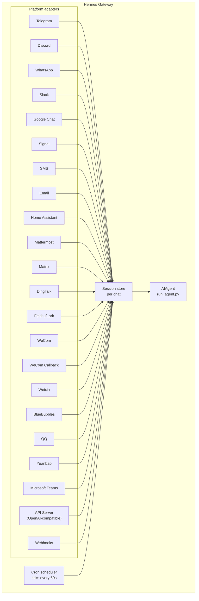

# 消息传递网关

您可以通过 Telegram、Discord、Slack、WhatsApp、Signal、短信、电子邮件、Home Assistant、Mattermost、Matrix、钉钉、飞书/企业微信、微信、BlueBubbles（iMessage）、QQ、元宝、Microsoft Teams、LINE、ntfy 或浏览器与 Hermes 进行聊天。该网关是一个后台进程，可连接所有已配置的平台，管理会话、执行定时任务，并传递语音消息。

如需了解完整的语音功能集——包括 CLI 麦克风模式、消息中的语音回复以及 Discord 语音频道对话功能，请参阅 [语音模式](/user-guide/features/voice-mode) 和 [在 Hermes 中使用语音模式](/guides/use-voice-mode-with-hermes)。

:::提示
机器人需要模型提供方以及工具提供方（文本转语音、网页接口等）。[Nous Portal](/integrations/nous-portal) 的订阅服务可一次性整合所有这些功能。
:::

## 桌面端及控制面板中的消息状态

消息状态取决于所选设备上对应的配置文件。通过 `hermes gateway setup` 保存的凭证，即便在 `config.yaml` 中没有对应的 `platforms` 条目，也能让该平台基于凭证正常运行；不过若明确设置了 `platforms.<name>.enabled: false`，则仍会禁用该平台。不同的配置文件不会继承服务器进程的凭证。那些缺少必需凭证字段的平台，并不会因为列表为空就被自动启用。

明确指定服务器自身的配置文件名称（例如在默认配置文件的服务器上使用 `profile=default`），其状态将与无范围限制的请求相同。**已保存**仅表示凭证已被存储，不代表消息网关正在运行或平台已建立连接。对于已启用的平台，应能正确显示**消息网关已停止**的状态。

## 平台对比

| Platform | Voice | Images | Files | Threads | Reactions | Typing | Streaming |
|----------|:-----:|:------:|:-----:|:-------:|:---------:|:------:|:---------:|
| Telegram | ✅ | ✅ | ✅ | ✅ | — | ✅ | ✅ |
| Discord | ✅ | ✅ | ✅ | ✅ | ✅ | ✅ | ✅ |
| Slack | ✅ | ✅ | ✅ | ✅ | ✅ | ✅ | ✅ |
| Google Chat | — | ✅ | ✅ | ✅ | — | ✅ | — |
| WhatsApp | — | ✅ | ✅ | — | — | ✅ | ✅ |
| WhatsApp Cloud API | ✅ | ✅ | ✅ | — | — | ✅ | — |
| Signal | — | ✅ | ✅ | — | — | ✅ | — |
| SMS | — | — | — | — | — | — | — |
| Email | — | ✅ | ✅ | ✅ | — | — | — |
| Home Assistant | — | — | — | — | — | — | — |
| Mattermost | ✅ | ✅ | ✅ | ✅ | — | ✅ | ✅ |
| Matrix | ✅ | ✅ | ✅ | ✅ | ✅ | ✅ | ✅ |
| DingTalk | — | ✅ | ✅ | — | ✅ | — | ✅ |
| Feishu/Lark | ✅ | ✅ | ✅ | ✅ | ✅ | ✅ | ✅ |
| WeCom | ✅ | ✅ | ✅ | — | — | — | — |
| WeCom Callback | — | — | — | — | — | — | — |
| Weixin | ✅ | ✅ | ✅ | — | — | ✅ | — |
| BlueBubbles | — | ✅ | ✅ | — | ✅ | ✅ | — |
| Photon (iMessage) | ✅ | ✅ | ✅ | — | ✅ | ✅ | — |
| QQ | ✅ | ✅ | ✅ | — | — | ✅ | — |
| Yuanbao | ✅ | ✅ | ✅ | — | — | ✅ | ✅ |
| Microsoft Teams | — | ✅ | — | ✅ | — | ✅ | — |
| LINE | — | ✅ | ✅ | — | — | ✅ | — |
| ntfy | — | — | — | — | — | — | — |
| Raft | — | — | — | — | — | — | — |
| IRC | — | — | — | — | — | — | — |
| Buzz | — | ✅ | — | ✅ | — | — | — |
| SimpleX | ✅ | ✅ | ✅ | — | — | ✅ | — |

**语音功能** = 通过文本转语音技术生成回复及/或对语音消息进行转写。**图片功能** = 发送/接收图片。**文件功能** = 发送/接收文件附件。**主题对话** = 支持多主题的对话交流。**表情反应** = 对消息发送的表情符号反馈。**输入状态指示** = 处理消息时的输入中提示。**流式更新** = 通过内容编辑实现消息的逐步更新。

:::注意 Hermes Relay
[Hermes Relay](/user-guide/messaging/relay)（实验性功能）本身并非聊天平台，而是一个连接系统。它通过拥有相应平台凭据的外部连接器，为 Discord、Telegram、Slack 和 WhatsApp 等平台提供接入服务。各项功能（如媒体传输、原生确认/澄清提示、表情反应、主题对话、输入状态指示、流式更新等）的具体实现方式需在连接建立时根据所使用的连接器进行协商，而非完全遵循上表中的固定设置。
:::

## 架构设计



每个平台适配器都会接收消息，通过针对单次聊天会话的存储机制对消息进行路由，然后将其发送给AIAgent进行处理。此外，网关还会运行定时调度程序，每隔60秒检查一次是否有需要执行的任务。

## 明确的静默令牌

对于群组聊天、钩子功能以及自动化流程，Hermes支持使用明确的静默令牌。如果智能体的最终回复恰好是其中一个受支持的令牌，网关就会停止向外发送消息，不会向聊天窗口传递任何内容。

支持的令牌包括：

- `[SILENT]`
- `SILENT`
- `NO_REPLY`
- `NO REPLY`

虽然空格和大小写会被统一处理，但最终回复的内容必须完全是该令牌本身。像“如果没有任何变化，请使用 `[SILENT]`”这样的句子则会正常发送。

静默功能仅用于决定是否发送消息。Hermes仍会在会话记录中保留助手的静默轮次，因此对话仍能正常交替进行：

```text
user: side-channel chatter
assistant: [SILENT]   # stored, not delivered
user: next message
```

即便某些轮次并未实际发生对话，仍会以错误形式出现；Hermes不会仅因为相关文本看起来像静默标记就隐藏这些失败情况。

## 快速设置

配置消息平台最简单的方法便是使用交互式向导：

```bash
hermes gateway setup        # Interactive setup for all messaging platforms
```

本指南将引导您通过方向键选择来配置各个平台，显示哪些平台已完成配置，并在设置完毕后提供启动/重启网关的选项。

## 网关命令

```bash
hermes gateway              # Run in foreground
hermes gateway setup        # Configure messaging platforms interactively
hermes gateway install      # Install as a user service (Linux) / launchd service (macOS)
sudo hermes gateway install --system   # Linux only: install a boot-time system service
hermes gateway start        # Start the default service
hermes gateway stop         # Stop the default service
hermes gateway status       # Check default service status
hermes gateway status --system         # Linux only: inspect the system service explicitly
```

### 可选的 Linux 事件循环监控功能

由 systemd 管理的网关可在 Python 的 asyncio 事件循环停止接收调度时间时启用进程恢复功能。该功能可解决导致平台特定存活检测任务无法运行的全进程卡死问题。

```yaml title="~/.hermes/config.yaml"
gateway:
  systemd_watchdog_seconds: 120
```

更改此设置后，请重新生成服务单元：

```bash
hermes gateway install --force
```

当该值为正数时，生成的单元将使用 `Type=notify`、`NotifyAccess=main` 以及相应的 `WatchdogSec` 参数。Hermes 仅在其事件循环正常运行时才会发送心跳信号；一旦事件循环停止，systemd 便会重启该进程。默认值 `0` 会保持原有的 `Type=simple` 行为模式。此设置仅适用于 Linux/systemd 环境，且不会将普通平台上的网络断开视为事件循环故障。 

## 聊天命令（在消息界面内使用）

| Command | Description |
|---------|-------------|
| `/new` or `/reset` | Start a fresh conversation |
| `/model [provider:model]` | Show or change the model (supports `provider:model` syntax) |
| `/personality [name]` | Set a personality (`none` to reset) |
| `/retry` | Retry the last message |
| `/undo` | Remove the last exchange |
| `/status` | Show session info |
| `/whoami` | Show your slash command access on this scope (admin / user / unrestricted) |
| `/stop` | Stop the running agent |
| `/approve` | Approve a pending dangerous command |
| `/deny` | Reject a pending dangerous command |
| `/sethome` | Set this chat as the home channel |
| `/compress` | Manually compress conversation context |
| `/title [name]` | Set or show the session title |
| `/resume [name]` | Resume a previously named session |
| `/sessions [all] [search <query>]` | List previous sessions; `search <query>` filters by title or id |
| `/usage` | Show token usage for this session (`/usage reset [--force]` redeems a banked Codex limit reset) |
| `/insights [days]` | Show usage insights and analytics |
| `/reasoning [level\|show\|hide]` | Change reasoning effort or toggle reasoning display |
| `/voice [on\|off\|tts\|join\|leave\|status]` | Control messaging voice replies and Discord voice-channel behavior |
| `/rollback [number]` | List or restore filesystem checkpoints |
| `/bg <prompt>` | Run a prompt in a separate background session |
| `/btw <question>` | Ask a side question about the current conversation without interrupting it |
| `/reload-mcp` | Reload MCP servers from config |
| `/update` | Update Hermes Agent to the latest version |
| `/help` | Show available commands |
| `/<skill-name>` | Invoke any installed skill |

## 会话管理

### 会话持久化

会话会在消息之间持续存在，直到被重置。智能体能够记住您的对话上下文。

### 查找历史会话（`/sessions`）

`/sessions` 可以列出当前聊天的所有历史会话——包括您正在使用的会话，该会话会标记为 `(current)`——而 `/sessions <name>` 可以恢复某个会话（即 `/resume` 的简写）。当会话列表变得过长时，可以使用 `/sessions search <query>`（别名 `find`）按标题或会话 ID 进行筛选，并按最近活跃的顺序排列。仅管理员可使用 `/sessions all` 查看跨来源的会话列表；普通用户则会收到提示，说明列表仅限于当前聊天范围，他们只能看到自己所在聊天的会话。

### 持久的 `/model` 覆盖设置

在网关聊天中使用的 `/model` 设置仅适用于当前会话，并且**不会因网关重启而丢失**：所选择的模型/提供方信息会被保存到会话存储中，在重启后首次使用时会被重新加载（凭证会在加载时重新获取，且不会被写入磁盘）。使用 `/new`（或 `/reset`）可以清除该覆盖设置，而 `/model <name> --global` 则会将设置直接写入 `config.yaml` 文件。`/model <name> --once` 的设置仅适用于单次对话轮次。

### 交付可靠性

每次平台发送消息后，智能体的最终响应都会被记录在持久化的**交付日志**（`state.db`）中。如果在生成响应与平台确认收到响应之间，网关发生崩溃或重启，系统会在下次启动时重新发送已存储的响应，而不会丢失数据——也无需重新处理整个对话轮次。

语义传输遵循“至少一次可靠”原则：

- 若响应的发送**从未开始**，则会原样重新发送。
- 当网关发生故障时，若响应正处于**发送过程中**（平台可能已收到，也可能尚未收到），则会重新发送，并在内容前加上明显的“♻️ 已恢复的回复 — … 可能是重复内容”前缀。系统会对此类情况进行标注，而不会默默地重新发送。
- 因**流量限制**（如 Telegram 的速率限制）导致最终发送被拒绝时，系统会在设定的惩罚时间结束后自动重试，无需重新连接或重启代理。在惩罚期间重启时，系统会直接使用已存储的回复，无需再进行重试或重新运行代理。所有重试都会保留原有的机器人配置、聊天记录及对话线程。速率限制恢复前的缀语会提示之前的消息内容可能已经送达；因为仅凭消息长度无法判断是否为部分传输。
- 重新发送有次数限制：最多尝试3次，内容有效期为24小时，之后该条记录将被丢弃。已成功送达的记录则会在7天后被清理。

如需禁用此功能，可在 `config.yaml` 中设置 `gateway.delivery_ledger: false`（这将恢复旧有的行为：系统崩溃时正在发送中的响应会丢失）。

### 会话连续性

即使长时间未活动或达到每日时间节点，网关对话也不会被重置。如需明确开启新对话，可使用 `/new` 或 `/reset` 命令；上下文压缩功能仍会自动运行。旧的 `session_reset` 设置、重置策略覆盖项以及重置计时器环境变量均会被忽略。为释放资源，系统可能会释放缓存中的智能体，而无需替换已保存的持久对话记录。重启恢复后的新鲜度限制会影响自动续谈功能，但不会影响发送消息时所加载的对话历史记录。

## 每个频道的模型配置与系统提示词覆盖

通过**同一个网关**，不同的频道可以运行不同的模型和角色设定——例如在 `#daily` 频道中使用成本低廉的快速模型，在 `#dev` 频道中使用带有专业提示词的先进模型。你可以在 `~/.hermes/config.yaml` 文件中的平台配置项下设置 `channel_overrides` 参数来实现这一功能：

```yaml
platforms:
  discord:
    enabled: true
    channel_overrides:
      "123456789012345678":        # channel/thread id
        model: anthropic/claude-sonnet-4.6
        provider: anthropic
        system_prompt: "You are the #dev channel code-review specialist."
      "987654321098765432":
        model: openai/gpt-5-mini
```

详细说明：

- 这三个参数均为可选项——可仅设置 `model`、仅设置 `system_prompt`，或任意组合。未设置的字段将自动采用全局默认值。
- 查找顺序为先精确匹配频道/线程 ID，再匹配其**父级**频道/论坛 ID——因此 Discord 线程会自动继承其父级频道的自定义设置。
- 模型的优先级排序为：会话级别的 `/model` 自定义设置 → `channel_overrides` 设置 → 全局配置。用户在聊天中直接输入 `/model` 的设置仍会优先于频道默认值。
- `system_prompt` 的自定义设置会替换该频道的全球网关提示词（该设置是临时的——每轮对话都会重新注入，不会保存在历史记录中）。

## 安全性

**默认情况下，网关会拒绝所有未在允许列表中或未通过私信配对的用户访问。** 这是对具备终端访问权限的机器人而言最安全的默认设置。

```bash
# Restrict to specific users (recommended):
TELEGRAM_ALLOWED_USERS=123456789,987654321
DISCORD_ALLOWED_USERS=123456789012345678
SIGNAL_ALLOWED_USERS=+155****4567,+155****6543
SMS_ALLOWED_USERS=+155****4567,+155****6543
EMAIL_ALLOWED_USERS=trusted@example.com,colleague@work.com
MATTERMOST_ALLOWED_USERS=3uo8dkh1p7g1mfk49ear5fzs5c
MATRIX_ALLOWED_USERS=@alice:matrix.org
DINGTALK_ALLOWED_USERS=user-id-1
FEISHU_ALLOWED_USERS=ou_xxxxxxxx,ou_yyyyyyyy
WECOM_ALLOWED_USERS=user-id-1,user-id-2
WECOM_CALLBACK_ALLOWED_USERS=user-id-1,user-id-2
TEAMS_ALLOWED_USERS=aad-object-id-1,aad-object-id-2

# Or allow
GATEWAY_ALLOWED_USERS=123456789,987654321

# Or explicitly allow all users (NOT recommended for bots with terminal access):
GATEWAY_ALLOW_ALL_USERS=true
```

### 直播消息配对功能（允许列表的替代方案）

无需手动配置用户 ID，未知用户在向机器人发送直播消息时将会收到一个一次性配对码。电子邮件则属于例外情况：除非已明确启用邮件配对功能，否则系统会忽略来自未知发件人的邮件。

```bash
# The user sees: "Pairing code: XKGH5N7P"
# You approve them with:
hermes pairing approve telegram XKGH5N7P

# Other pairing commands:
hermes pairing list          # View pending + approved users
hermes pairing revoke telegram 123456789  # Remove access
```

配对码的有效期为1小时，其生成受到速率限制，并采用加密随机方式产生。

### 管理员与普通用户

允许列表用于判断“此人是否能够连接到机器人？”，而**管理员/用户划分**则用于确定“一旦他们成功连接，能被允许执行哪些操作？” 

对于每个作用域（私信或群组/频道），每位获准使用的用户都会被划分为两个层级之一：

- **管理员**——拥有完全权限。可以调用所有已注册的斜杠命令（包括内置命令和插件命令），并能使用所有受限制的功能。
- **普通用户**——权限受限。可以正常与机器人进行聊天，但仅能使用您明确启用的斜杠命令。始终允许使用的命令为 `/help` 和 `/whoami`。

这些层级是根据不同平台及作用域来配置的。私信中的管理员身份并不等同于群组/频道中的管理员身份——每个作用域都有独立的管理员列表。

**目前受这些层级限制的是：斜杠命令。** 由于这种划分是基于实时命令注册表实现的，因此它同时涵盖了内置命令和插件注册的命令，而无需为每个功能单独设置规则。普通聊天功能不受影响——非管理员仍可与机器人对话。

**未来可能受到限制的功能包括：** 更多的功能模块（如工具访问、模型切换、高耗资源操作等）也将依据同样的管理员/用户划分机制进行管理。现在就做好相应配置，就能让未来的限制措施顺畅实施，无需再次调整管理员名单。

#### 配置方式

```yaml
gateway:
  platforms:
    discord:
      extra:
        allow_from: ["111", "222", "333"]
        allow_admin_from: ["111"]                    # admins → all slash commands
        user_allowed_commands: [status, model]       # what non-admins may run
        # Optional: separate group/channel scope
        group_allow_admin_from: ["111"]
        group_user_allowed_commands: [status]
```

**向后兼容性：** 若某个作用域未设置 `allow_admin_from`，则该作用域将关闭层级划分机制，所有被允许的用户均可拥有完全访问权限。现有安装无需任何更改即可继续正常运行——如需启用层级区分功能，可随时进行配置。

#### 查看自身访问权限

在任何平台上使用 `/whoami` 命令，即可查看当前所在的作用域、您的权限层级（管理员/用户/无限制），以及您可以使用的斜杠命令。有关各平台的具体示例，请参阅 [Telegram](/user-guide/messaging/telegram#slash-command-access-control) 和 [Discord](/user-guide/messaging/discord#slash-command-access-control) 页面。

## 重新引导智能体

当智能体正在处理任务时，发送消息即可中断当前操作流程：

- **模型生成会保留上下文并重新开始**——此前已展示的推理过程及可见的文本内容会作为普通助手检查点被保留下来；
- **已完成的工作依然有效**——之前的工具调用及其结果仍保留在当前任务流程中；
- **正在运行的工具会安全完成**——修正操作会在下一个工具结果生成节点执行，而不会中断工具运行；
- **`/stop` 命令仍可强制终止**——可使用该命令取消当前任务流程及正在处理的工作。

### 队列模式、中断模式与引导模式（忙碌输入模式）

默认情况下，向正在处理的智能体发送消息会使其重新开始当前任务流程（正在运行的前台终端命令会被移至后台而非强制终止，因此您的消息能立即被读取）。此外还有另外两种模式可供选择：

- `queue` — 后续消息会等待当前任务处理完成后，在下一个轮次中执行。  
- `steer` — 后续消息会通过 `/steer` 命令注入到当前的运行任务中，在下一次工具调用之后送达智能体。该方式不会中断当前流程，也不会开启新的轮次；如果智能体尚未开始运行，则会回退至 `queue` 模式。  

无论是网关驱动的 `steer` 操作（包括显式的 `/steer` 命令），还是主动轮次重定向，都会在每条消息的 JSON 上下文中标明请求事件相关的平台、聊天窗口、线程、发送者、消息内容、用户资料以及范围等标识符。当设置 `privacy.redact_pii: true` 时，这些在模型可见范围内的标识符会在支持的平台上进行哈希处理，包括替代标识符和父级标识符；而原始的事件标识符则仍会保留以用于内部路由。否则，这些标识符将会被原样保留。这两种模式均不会更改会话的系统提示语，也不会指定默认的回复目标。该上下文仅用于路由传输，不涉及授权功能，也不能保证消息一定能成功送达。

```yaml
display:
  busy_input_mode: steer   # or queue, or interrupt (default)
  busy_ack_enabled: true   # set to false to suppress the ⚡/⏳/⏩ chat reply entirely
```

首次在任何平台上向正在忙碌的智能体发送消息时，Hermes 会在忙碌确认信息中附加一行提示，说明相关提示内容（“💡 首次使用提示 — …”）。该提示仅在应用安装时显示一次，`onboarding.seen.busy_input_prompt` 中的标志位会记录这一状态。若要再次查看该提示，可删除该键值。

如果您觉得忙碌确认信息过于烦扰，可设置 `display.busy_ack_enabled: false`。此时消息处理方式保持不变，仅隐藏确认消息。

## 明确问题（多选）

当智能体使用 `clarify` 工具向您提问时，网关会将选项以编号形式呈现（在支持的原生界面中则显示为按钮）。该工具也支持**多选**问题——智能体允许您一次性选择多个选项：

- **消息平台**：提示会显示“允许多选”；回复时可输入用逗号或空格分隔的数字、选项文本，或自行输入自由形式的答案。
- **传统 CLI/TUI 环境**：多选选项将以复选框形式呈现：按**空格键**切换选项状态，按**回车键**提交所选选项。

单选提示的交互方式与以往相同：可通过数字、按钮或文本选择一项，或通过“其他”选项输入自定义答案。

## 工具进度通知

您可以在 `~/.hermes/config.yaml` 中设置要显示的工具操作进度程度：

```yaml
display:
  tool_progress: all    # off | new | all | verbose | log
  tool_progress_command: false  # set to true to enable /verbose in messaging
  # How progress is grouped on platforms that support message editing:
  #   accumulate (default) — edit one bubble in place as tools run
  #   separate             — send one message per tool (pre-v0.9 style; noisier)
  # Only applies where tool_progress is already enabled.
  tool_progress_grouping: accumulate   # accumulate | separate
```

### `log` 模式——记录审计文件而非聊天消息

将 `display.tool_progress: log` 设为该值后，**不会**在聊天界面中显示进度提示。相反，每次工具调用都会作为一行内容追加到 `~/.hermes/logs/tool_calls.log` 文件中——这是一个循环使用的审计文件（大小为 5 MB，保留 3 个备份版本），其格式化方式与普通日志相同，能够自动隐藏敏感信息，从而确保凭证不会被保存到磁盘上。当您需要完整的工具调用记录且不希望出现任何聊天界面干扰时，可使用此模式。

### 可配置的状态短语

用于显示长时间运行中的网关状态信息的短语（类似“仍在处理中…”的动态反馈）来自一个预置的短语库。默认短语位于 `gateway/assets/status_phrases.yaml` 文件中；您也可以在 `HERMES_HOME` 目录下使用跨配置文件兼容的格式添加自定义短语：

- `~/.hermes/status_phrases.yaml`，或
- `~/.hermes/status_phrases/` 目录下的任意 `*.yaml` 文件（系统会自动加载这些常规路径下的文件），或者
- 通过配置文件指定相对路径：

```yaml
display:
  status_phrases:
    path: status_phrases/whatsapp.yaml  # relative to HERMES_HOME
    mode: append                        # append (default) or replace
```

短语文件会将某个表面（如 `status`、`generic`）映射为一组字符串列表（每个表面最多包含80条短语，每条短语长度不超过160个字符）。系统会忽略绝对路径以及 `..` 这样的路径引用，从而确保配置在不同环境中都能正常使用。仅会使用您已配置的短语字符串——原始的工具参数、命令及推理文本绝不会被插入到状态短语中。

### 模型上下文中的消息时间戳

默认情况下为关闭状态。启用该功能后，Hermes 会在模型上下文中的每一条**用户消息**前添加一个易于识别的时间戳（例如 `[Tue 2026-04-28 13:40:53 CEST]`），以便智能体知晓消息的发送时间——这对于进行时间推理非常有用（比如“你是今天早上问的这个问题……”或识别出较长的时间间隔）。该功能**不会**添加到助手回复的消息或系统提示语中。

```yaml
gateway:
  message_timestamps:
    enabled: false   # set true to show send-times to the model
```

无论是否启用该功能，已保存的转录内容始终保持整洁——时间戳作为消息元数据被存储下来，因此即便之后再开启该功能，也能查看过往消息的发送时间；此外，重放功能也不会产生重复的前缀内容。

启用该功能后，机器人会在工作过程中发送状态消息：

```text
💻 `ls -la`...
🔍 web_search...
📄 web_extract...
🐍 execute_code...
```

## 后台会话

在独立的后台会话中运行提示语，这样智能体便可独立处理该任务，同时您的主聊天窗口仍能保持响应状态：

```
/bg Check all servers in the cluster and report any that are down
```

Hermes会立即予以确认：

```
🔄 Background task started: "Check all servers in the cluster..."
   Task ID: bg_143022_a1b2c3
```

### 工作原理

每个 `/bg` 提示词都会启动一个**独立的智能体实例**，以异步方式运行：

- **独立会话**——该后台智能体拥有专属的会话及对话历史记录。它无法知晓您当前的聊天上下文，仅能接收您提供的提示词。
- **相同配置**——继承自当前网关设置的模型、服务提供商、工具集、推理参数以及服务提供商路由规则。
- **非阻塞操作**——您的主聊天窗口仍可保持完全交互状态。在后台任务运行期间，您可以继续发送消息、执行其他命令或启动更多后台任务。
- **结果反馈**——当任务完成后，结果会以“✅ 后台任务已完成”的格式返回到您发出命令的**同一聊天窗口或频道**中；若任务失败，则会显示“❌ 后台任务失败”并附带错误信息。

### 后台进程通知

当正在运行后台会话的智能体使用 `terminal(background=true)` 启动长时间运行的进程（如服务器、构建任务等）时，网关可将状态更新推送到您的聊天窗口。您可以通过在 `~/.hermes/config.yaml` 中设置 `display.background_process_notifications` 来控制此功能：

```yaml
display:
  background_process_notifications: concise    # concise | all | result | error | off
```

| 模式 | 返回内容 |
|------|----------|
| `concise` | 完成时返回一行状态信息；失败时会附加简短的输出尾部内容（默认模式） |
| `all` | 同时显示运行过程中的实时输出以及最终的原始输出信息 |
| `result` | 仅显示最终的原始输出完成信息（与退出码无关） |
| `error` | 仅在退出码非零时显示最终的原始输出信息 |
| `off` | 完全不显示进程监控相关消息 |

您也可以通过环境变量来设置该参数：

```bash
HERMES_BACKGROUND_NOTIFICATIONS=result
```

### 应用场景

- **服务器监控** — “/bg 检查所有服务的运行状态，如有任何服务异常则向我发送警报”
- **长时间构建任务** — 在您继续聊天时，“/bg 构建并部署测试环境”
- **研究任务** — “/bg 调查竞争对手的定价信息，并以表格形式汇总结果”
- **文件操作** — “/bg 按日期将~/Downloads目录中的照片分类到对应文件夹中”

:::提示
在消息平台上运行的后台任务属于“提交即忘”型——无需等待或查看进度。任务完成后，结果会自动出现在同一聊天窗口中。
:::

## 服务管理

### Linux（systemd）

```bash
hermes gateway install               # Install as user service
hermes gateway start                 # Start the service
hermes gateway stop                  # Stop the service
hermes gateway status                # Check status
journalctl --user -u hermes-gateway -f  # View logs

# Enable lingering (keeps running after logout)
sudo loginctl enable-linger $USER

# Or install a boot-time system service that still runs as your user
sudo hermes gateway install --system
sudo hermes gateway start --system
sudo hermes gateway status --system
journalctl -u hermes-gateway -f
```

在笔记本电脑及开发测试机上请使用用户服务；而在需要在上电后自动恢复运行且不依赖 systemd linger 功能的 VPS 或无头主机上，则应使用系统服务。

:::danger 禁止添加自定义的 `ExecStopPost` 终止脚本
Hermes 所安装的单元配置已能通过 `KillMode=mixed` + `KillSignal=SIGTERM` 的方式干净地关闭网关，并结合 `Restart=always` 与 `RestartForceExitStatus` 确保更新操作及执行 `/restart` 命令后能正确重新启动。**切勿**添加诸如 `ExecStopPost=/bin/kill -9 $MAINPID` 这样的 systemd 替代脚本——因为 `ExecStopPost` 会在*每一次*停止操作时触发，包括正常的重启过程，这会导致新生成的实例在尚未稳定之前就被强制终止，而后 `Restart=always` 又会立即使其重新启动。如此一来就会形成无限循环重启（在 Telegram 上还会出现大量重启通知）。如果您已添加了此类脚本，请将其删除：执行 `systemctl --user edit hermes-gateway`（对于系统服务则使用 `sudo systemctl edit hermes-gateway`），删除 `ExecStopPost` 这一行，最后执行 `systemctl --user daemon-reload`。

:::

:::tip 无头虚拟机：结合用户服务与 linger 功能可避免出现 root 密码提示
系统服务每次重启都需要 root 权限——包括在 `hermes update` 完成后自动重启网关时。当以非 root 用户运行 `hermes update` 时，它会尝试使用无需密码的 `sudo systemctl` 命令；如果该功能不可用，它就会跳过重启操作，并输出手动执行的 `sudo systemctl restart hermes-gateway` 命令（而不会在需要输入交互式密码的环节阻塞）。

对于那些你从未登录过的无头虚拟机，只要启用持久化功能的**用户**服务，即可在无需使用 root 权限的情况下，实现与系统启动时相同的自动启动行为。

```bash
hermes gateway install          # user service
sudo loginctl enable-linger $USER   # one-time: start at boot, survive logout
```

之后，无需任何特殊权限即可通过 `hermes update` 命令重启网关。如果您希望保留系统服务，可以选择使用 `sudo hermes update` 来执行更新，或者为该服务账户授予对 systemctl 的无密码 sudo 权限，例如在 `sudo visudo -f /etc/sudoers.d/hermes-gateway` 中进行配置：

```
hermes ALL=(root) NOPASSWD: /usr/bin/systemctl --no-ask-password reset-failed hermes-gateway*, /usr/bin/systemctl --no-ask-password start hermes-gateway*, /usr/bin/systemctl --no-ask-password restart hermes-gateway*
```
:::

除非确实有必要，否则请避免同时安装用户端和系统网关版本。如果 Hermes 检测到两者共存，将会发出警告，因为这会导致启动、停止及状态查询等操作行为出现歧义。

:::info 多版本共存情况
如果在同一台机器上运行多个 Hermes 实例（且各自拥有不同的 `HERMES_HOME` 目录），每个实例都会拥有独立的 systemd 服务名称。默认的 `~/.hermes` 版本使用 `hermes-gateway` 作为服务名；其他版本则使用 `hermes-gateway-<hash>`。`hermes gateway` 命令会自动根据当前所处的 `HERMES_HOME` 路径，调用对应的服务。

:::

### macOS（launchd）

```bash
hermes gateway install               # Install as launchd agent
hermes gateway start                 # Start the service
hermes gateway stop                  # Stop the service
hermes gateway status                # Check status
tail -f ~/.hermes/logs/gateway.log   # View logs
```

生成的 plist 文件位于 `~/Library/LaunchAgents/ai.hermes.gateway.plist`。该文件包含三个环境变量：

- **PATH** — 安装时的完整 shell PATH，其开头会加上虚拟环境中的 `bin/` 和 `node_modules/.bin` 路径。这样就能确保用户安装的工具（如 Node.js、ffmpeg 等）能被 WhatsApp 桥接等网关子进程所使用。
- **VIRTUAL_ENV** — 指向 Python 虚拟环境，以便工具能够正确查找并加载包。
- **HERMES_HOME** — 将网关的作用范围限定在您的 Hermes 安装目录内。

:::提示 安装后 PATH 发生变化
launchd plist 文件是静态的——如果在设置好网关之后又安装了新工具（例如通过 nvm 安装新的 Node.js 版本，或通过 Homebrew 安装 ffmpeg），请再次运行 `hermes gateway install` 以更新 PATH。网关会检测到过时的 plist 文件并自动重新加载。
:::

:::信息 多个 Hermes 安装实例
与 Linux 的 systemd 服务类似，每个 `HERMES_HOME` 目录都会有独立的 launchd 标签。默认的 `~/.hermes` 使用标签 `ai.hermes.gateway`；其他安装则使用 `ai.hermes.gateway-<后缀>` 标签。
:::

## 各平台专属的工具集

不同平台拥有各自独立的工具集：

| Platform | Toolset | Capabilities |
|----------|---------|--------------|
| CLI | `hermes-cli` | Full access |
| Telegram | `hermes-telegram` | Full tools including terminal |
| Discord | `hermes-discord` | Full tools including terminal |
| WhatsApp | `hermes-whatsapp` | Full tools including terminal |
| WhatsApp Cloud API | `hermes-whatsapp` | Full tools including terminal (shares toolset with the Baileys bridge) |
| Slack | `hermes-slack` | Full tools including terminal |
| Google Chat | `hermes-google_chat` | Full tools including terminal |
| Signal | `hermes-signal` | Full tools including terminal |
| SMS | `hermes-sms` | Full tools including terminal |
| Email | `hermes-email` | Full tools including terminal |
| Home Assistant | `hermes-homeassistant` | Full tools + HA device control (ha_list_entities, ha_get_state, ha_call_service, ha_list_services) |
| Mattermost | `hermes-mattermost` | Full tools including terminal |
| Matrix | `hermes-matrix` | Full tools including terminal |
| DingTalk | `hermes-dingtalk` | Full tools including terminal |
| Feishu/Lark | `hermes-feishu` | Full tools including terminal |
| WeCom | `hermes-wecom` | Full tools including terminal |
| WeCom Callback | `hermes-wecom-callback` | Full tools including terminal |
| Weixin | `hermes-weixin` | Full tools including terminal |
| BlueBubbles | `hermes-bluebubbles` | Full tools including terminal |
| QQBot | `hermes-qqbot` | Full tools including terminal |
| Yuanbao | `hermes-yuanbao` | Full tools including terminal |
| Microsoft Teams | `hermes-teams` | Full tools including terminal |
| API Server | `hermes-api-server` | Full tools (drops `clarify`, `text_to_speech` — programmatic access doesn't have an interactive user) |
| Webhooks | `hermes-webhook` | Full tools including terminal |
| Raft | `hermes-raft` | Wake-only channel; agent uses Raft CLI for message I/O |

## 运行多平台网关

一个网关通常会同时运行多个适配器（如 Telegram + Discord + Slack 等）。以下内容介绍了适用于所有平台的后期运维操作。

### `/platform` 命令

在网关启动后，可通过任意已连接的 CLI 会话或聊天界面使用 `/platform` 命令，无需重启整个网关即可查看并控制各个适配器的运行状态：

```
/platform list                  # show all adapters and their state
/platform pause <name>          # stop dispatching new messages to one adapter
/platform resume <name>         # re-enable a paused adapter
```

`/platform list` 命令可显示每个适配器当前处于 `running`、`paused`（手动暂停）还是 `paused-by-breaker`（见下文）状态。暂停操作仅会停止适配器的运行并使其后台循环暂停——新收到的消息会被丢弃，但连接本身仍保持开启状态，因此可以立即恢复运行。

如需查看更全面的系统状态摘要，可参考命令 [`/platforms`](../../reference/slash-commands.md#info)。

### 禁用那些凭证仍存储在 `.env` 文件中的平台

在 `~/.hermes/config.yaml` 中设置 `platforms.<name>.enabled: false` 即可生效。
该平台留在环境变量中的凭证（如 `TELEGRAM_BOT_TOKEN`、`WEIXIN_TOKEN`、`HASS_TOKEN`、`EMAIL_*`、`TWILIO_ACCOUNT_SID` 等）虽仍存在于平台配置中，足以让仅用于发送消息的工具继续正常工作，但这些凭证已无法启动对应的适配器。

```yaml title="~/.hermes/config.yaml"
platforms:
  weixin:
    enabled: false   # wins over WEIXIN_TOKEN in .env
```

在早期版本中，只要凭证存在，即可重新启用十二个平台（微信、WhatsApp Cloud、Home Assistant、电子邮件、短信、钉钉、飞书、企业微信、企业微信回调、BlueBubbles、QQ机器人、元宝），而无需关心具体的密钥。若您曾依赖这种方式，那么现在网关在启动时会为每个受影响的平台记录一条警告信息，以避免整个系统完全无法正常运行。

```
Platform 'weixin' is explicitly disabled by platforms.weixin.enabled: false in config.yaml,
so the credentials found in the environment (WEIXIN_TOKEN, WEIXIN_ACCOUNT_ID) will NOT start
its adapter. Environment credentials no longer override an explicit disable. Remove the key
or set platforms.weixin.enabled: true to turn it back on.
```

完全省略 `enabled` 键即可保持仅依赖环境变量的运行模式：只要存在凭证，适配器就会启动。

### 忽略继承的代理设置（`gateway.trust_env`）

默认情况下，所有平台适配器都会遵循网关环境中的 `HTTP_PROXY` / `HTTPS_PROXY` / `NO_PROXY`（以及 `SSL_CERT_FILE`）设置，并自动检测 macOS 系统的代理设置。而通过 Windows 定时任务或服务管理器启动的网关，则可能会继承交互式shell无法识别的代理设置——比如某个尚未运行的本地 Clash/V2Ray 监听器——从而导致每次轮询时都出现“无法连接到 127.0.0.1:7890”的错误日志。如需立即关闭所有适配器对继承代理的依赖，可执行相应操作：

```yaml title="~/.hermes/config.yaml"
gateway:
  trust_env: false
```

针对不同平台的专用代理变量（如 `DISCORD_PROXY`、`TELEGRAM_PROXY`、`MATRIX_PROXY` 等）依然有效。修改这些变量后需重启网关。

### 自动断路保护机制

每个适配器均被封装在断路保护机制中。当出现重复的可重试故障时（如网络波动、速率限制响应、5xx级上游错误、WebSocket连接中断等），该机制会触发断开操作——此时适配器会自动暂停，若已配置其他直播平台的对应通道，则会向该通道发送操作员通知，同时还会生成结构化的日志记录。

需要注意的是，断路保护机制**不会**自动恢复功能，它将保持断开状态，直到您手动执行 `/platform resume <name>` 命令。这样做是有意为之：如果某个平台长期处于故障状态，就不希望网关不断尝试重新连接而白费资源。

### 平台暂停时该如何排查问题

当某个适配器被暂停时，请检查以下内容：

1. **网关日志**（位于 `~/.hermes/logs/gateway.log`，或 systemd / launchd 的服务日志中）。搜索该平台名称以及“circuit breaker”、“paused”或“disabled”等相关关键词。触发断开的记录会显示故障次数及最后出现的错误信息。
2. **`/platform list`** 的输出结果——其中会显示当前状态及暂停的原因。
3. **对应服务提供商的状态页面**（如 Telegram Bot API 状态、Discord 状态等）。由于平台运行异常才触发了断路保护，因此在平台恢复正常之前，请勿尝试恢复适配器功能。

一旦上游服务恢复正常，执行 `/platform resume <name>` 命令即可解除断路保护并重新启用该适配器。

### 重启通知机制

当网关重启（或在仍有进行中的会话时被关闭）时，它可以向各个平台的首页频道发送一条一次性消息，提示“代理已恢复”或“代理运行被中断”。这一功能可通过 `config.yaml` 文件中的 `gateway_restart_notification` 参数针对不同平台进行控制，该参数的默认值为 `true`：

```yaml
gateway:
  platforms:
    telegram:
      home_chat_id: "123456789"
      gateway_restart_notification: false   # opt out for this platform
    discord:
      home_chat_id: "987654321"
      # gateway_restart_notification omitted → defaults to true
```

在噪音较大或优先级较低的平台上可将其关闭，而在主要聊天平台则应保持开启状态。无论同时进行多少个会话，该通知都会在每次重启时发送一次。

### 输入中指示器

当智能体正在处理消息时，支持该功能的平台会显示实时的输入中状态——在 Telegram/Discord/Signal 上表现为“正在输入…”的提示气泡，而在 Slack 上则显示为“正在思考…”的助手状态。这一功能可通过 `config.yaml` 文件中的 `typing_indicator` 参数按平台进行控制，其默认值为 `true`：

```yaml
gateway:
  platforms:
    slack:
      typing_indicator: false   # don't show "is thinking…" on Slack
    telegram:
      # typing_indicator omitted → defaults to true
```

在不需要显示该指示器的平台上，可将 `typing_indicator: false` 设置为该值。部分用户认为 Slack 的“正在思考中”状态过于烦人（由于它使用了 Slack 的 Assistant API，该状态显示时还会暂时禁用输入框）。关闭此功能仅能隐藏指示器——消息发送及其他功能均保持不变。由于该参数具有通用性，因此所有平台都适用相同的键名。

### 网关重启后的会话恢复

当网关在处理中的工具调用或内容生成过程中关闭时，受影响的会话会被标记为 `restart_interrupted`。在下次启动时，网关会为每个此类会话安排自动恢复——用户会在聊天中收到简短提示（“重启后请发送任意消息，我会尝试从您中断的地方继续处理。”），随后会话会从用户回复时的最后保存状态继续进行。

此功能默认处于开启状态，并会在网关启动时记录相关日志：

```
Scheduled auto-resume for N restart-interrupted session(s)
```

无需进行任何配置。如果您不想收到相关提示，可在平台上将 `gateway_restart_notification` 设置为 `false`。

### 适配移动端的默认进度显示设置

由于 Telegram 通常作为移动端消息应用使用，因此默认设置已针对该场景进行了优化：

- **`tool_progress`** 的默认值为 **`off`** —— 不会在聊天界面中显示各工具的进度追踪信息。
- **`busy_ack_detail`** 的默认值为 **`off`** —— 空闲状态确认及长时间运行的心跳信号将保持简洁（不会显示如“第21/60次迭代”之类的详细调试信息）。
- **`interim_assistant_messages`** 保持 **`on`** 状态 —— 模型在处理任务过程中会实时说明其正在执行的操作，这类信息属于有用提示而非干扰内容。
- **`long_running_notifications`** 保持 **`on`** 状态 —— 每几分钟会更新一次“⏳ 正在处理中 —— 剩余N分钟”的提示，让您随时掌握进度，而无需盯着“正在输入…”的状态等待半小时。

您可以选择关闭上述保持开启的默认设置，或根据不同平台重新启用详细的进度显示功能。

```yaml
display:
  platforms:
    telegram:
      # Re-enable the tool-progress stream
      tool_progress: new
      # Show "iteration N/M, running: tool" in heartbeats and busy acks
      busy_ack_detail: true
      # Or quiet them entirely
      interim_assistant_messages: false
      long_running_notifications: false
```

### 进度提示框自动清理（可选功能）

在最终响应返回后，工具进度提示、“仍在处理中…”的动态心跳指示以及状态回调提示框也可被自动删除。可通过 `display.platforms.<platform>.cleanup_progress` 根据不同平台启用该功能：

```yaml
display:
  platforms:
    telegram:
      cleanup_progress: true
    discord:
      cleanup_progress: true
```

默认值为 `false`。仅当对应平台的适配器实现了 `delete_message` 功能时，才会遵循此设置（目前为 Telegram 和 Discord）。在运行失败时，系统会**跳过**清理操作，因此这些提示气泡仍会作为操作记录保留。

## 后续步骤

- [Telegram 设置](telegram.md)
- [Discord 设置](discord.md)
- [Slack 设置](slack.md)
- [Google Chat 设置](google_chat.md)
- [WhatsApp 设置](whatsapp.md)
- [WhatsApp Business Cloud API 设置](whatsapp-cloud.md)
- [Signal 设置](signal.md)
- [SMS 设置（Twilio）](sms.md)
- [邮件设置](email.md)
- [Home Assistant 集成](homeassistant.md)
- [Mattermost 设置](mattermost.md)
- [Matrix 设置](matrix.md)
- [钉钉设置](dingtalk.md)
- [飞书/Lark 设置](feishu.md)
- [企业微信设置](wecom.md)
- [企业微信回调设置](wecom-callback.md)
- [微信设置（WeChat）](weixin.md)
- [BlueBubbles 设置（iMessage）](bluebubbles.md)
- [Photon 设置（iMessage）](photon.md)
- [QQBot 设置](qqbot.md)
- [元宝设置](yuanbao.md)
- [Microsoft Teams 设置](teams.md)
- [Teams 会议处理流程](teams-meetings.md)
- [Microsoft Graph Webhook 监听器](msgraph-webhook.md)
- [LINE 设置](line.md)
- [ntfy 设置](ntfy.md)
- [SimpleX Chat 设置](simplex.md)
- [Open WebUI + API 服务器](open-webui.md)
- [Raft 设置](raft.md)
- [IRC 设置](irc.md)
- [Buzz 设置](buzz.md)
- [A2A（智能体间交互）设置](a2a.md)
- [Webhooks](webhooks.md)
