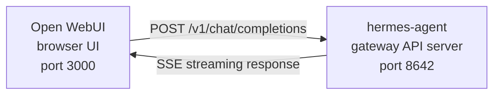

# 开放式 WebUI 集成

[Open WebUI](https://github.com/open-webui/open-webui)（12.6万★）是目前最受欢迎的 AI 自托管聊天界面。借助 Hermes Agent 内置的 API 服务器，您可以将 Open WebUI 作为代理的精美网页前端，它具备对话管理、用户账户功能以及现代化的聊天界面。 

## 架构设计



Open WebUI 与 Hermes Agent 的 API 服务器的连接方式，与它连接 OpenAI 的方式相同。Hermes 会利用其完整的工具集——终端操作、文件处理、网络搜索、内存功能以及各种技能——来处理请求，并返回最终结果。

:::重要：运行时位置
该 API 服务器属于 **Hermes Agent 运行时环境**，而非单纯的 LLM 代理。对于每个请求，Hermes 都会在 API 服务器所在的主机上创建一个服务器端的 `AIAgent` 对象。各类工具调用均在该 API 服务器运行的位置执行。

例如，如果将 Open WebUI 或其他兼容 OpenAI 的客户端配置为连接到远程机器上的 Hermes API 服务器，那么 `pwd` 命令、文件操作工具、浏览器工具、本地 MCP 工具以及其他工作区工具都将在远程 API 服务器上运行，而非在笔记本电脑上。
:::

Open WebUI 采用服务器对服务器的方式与 Hermes 进行通信，因此在这种集成场景下无需设置 `API_SERVER_CORS_ORIGINS` 参数。

## 快速设置

### 一键本地启动（macOS/Linux，无需 Docker）

如果您希望通过一个可重复使用的启动脚本在本地将 Hermes 与 Open WebUI 直接连接起来，请运行以下命令：

```bash
cd ~/.hermes/hermes-agent
bash scripts/setup_open_webui.sh
```

脚本的功能：

- 确保 `~/.hermes/.env` 文件中包含 `API_SERVER_ENABLED`、`API_SERVER_HOST`、`API_SERVER_KEY`、`API_SERVER_PORT` 以及 `API_SERVER_MODEL_NAME` 这些参数；
- 重启 Hermes 网关，从而启动 API 服务器；
- 将 Open WebUI 安装到 `~/.local/open-webui-venv` 目录中；
- 在 `~/.local/bin/start-open-webui-hermes.sh` 处创建启动脚本；
- 在 macOS 系统上安装 `launchd` 用户服务；在基于 `systemd --user` 的 Linux 系统上则在该系统中安装用户服务。

默认值：

- Hermes API 地址：`http://127.0.0.1:8642/v1`
- Open WebUI 地址：`http://127.0.0.1:8080`
- 提供给 Open WebUI 的模型名称：`Hermes Agent`

常用自定义选项：

```bash
OPEN_WEBUI_NAME='My Hermes UI' \
OPEN_WEBUI_ENABLE_SIGNUP=true \
HERMES_API_MODEL_NAME='My Hermes Agent' \
bash scripts/setup_open_webui.sh
```

在 Linux 系统上，要自动设置后台服务，必须先有一个可正常运行的 `systemd --user` 会话。如果您使用的是无界面 SSH 服务器且希望跳过服务安装步骤，请运行以下命令：

```bash
OPEN_WEBUI_ENABLE_SERVICE=false bash scripts/setup_open_webui.sh
```

### 1. 启用 API 服务器

```bash
hermes config set API_SERVER_ENABLED true
hermes config set API_SERVER_KEY your-secret-key
```

`hermes config set` 命令会自动将相关参数写入 `config.yaml` 文件，而敏感信息则会存储在 `~/.hermes/.env` 文件中。如果网关已在运行，需重新启动它才能使更改生效：

```bash
hermes gateway stop && hermes gateway
```

### 2. 启动 Hermes Agent 网关

```bash
hermes gateway
```

您应该会看到：

```
[API Server] API server listening on http://127.0.0.1:8642
```

### 3. 验证 API 服务器是否可访问

```bash
curl -s http://127.0.0.1:8642/health
# {"status": "ok", ...}

curl -s -H "Authorization: Bearer your-secret-key" http://127.0.0.1:8642/v1/models
# {"object":"list","data":[{"id":"hermes-agent", ...}]}
```

如果执行 `/health` 命令失败，说明网关未读取到 `API_SERVER_ENABLED=true` 的配置——请重启网关。若调用 `/v1/models` 返回 `401` 错误，则表示您的 `Authorization` 请求头与 `API_SERVER_KEY` 不匹配。

### 4. 启动 Open WebUI

```bash
docker run -d -p 3000:8080 \
  -e OPENAI_API_BASE_URL=http://host.docker.internal:8642/v1 \
  -e OPENAI_API_KEY=your-secret-key \
  -e ENABLE_OLLAMA_API=false \
  --add-host=host.docker.internal:host-gateway \
  -v open-webui:/app/backend/data \
  --name open-webui \
  --restart always \
  ghcr.io/open-webui/open-webui:main
```

`ENABLE_OLLAMA_API=false` 用于禁用默认的 Ollama 后端，否则该后端会以空白状态显示，从而造成模型选择器的杂乱。如果您确实同时运行了 Ollama，则无需设置此参数。

首次启动需要 15–30 秒：WebUI 在首次启动时会下载 sentence-transformer 嵌入模型（约 150MB）。在打开用户界面之前，请先等待 `docker logs open-webui` 的输出停止。

### 5. 打开用户界面

访问 **http://localhost:3000**。创建您的管理员账户（第一个创建的用户即为管理员）。您应该能在模型下拉列表中看到自己的智能体（名称为您的个人资料名，或默认个人资料的 **hermes-agent**）。现在就可以开始聊天啦！

## Docker Compose 部署方式

如需更稳定的长期部署，可创建一个 `docker-compose.yml` 文件：

```yaml
services:
  open-webui:
    image: ghcr.io/open-webui/open-webui:main
    ports:
      - "3000:8080"
    volumes:
      - open-webui:/app/backend/data
    environment:
      - OPENAI_API_BASE_URL=http://host.docker.internal:8642/v1
      - OPENAI_API_KEY=your-secret-key
      - ENABLE_OLLAMA_API=false
    extra_hosts:
      - "host.docker.internal:host-gateway"
    restart: always

volumes:
  open-webui:
```

接着：

```bash
docker compose up -d
```

## 通过管理界面进行配置

如果您更倾向于通过用户界面而非环境变量来配置连接，可按以下步骤操作：

1. 在 **http://localhost:3000** 打开 Open WebUI
2. 点击您的 **个人头像** → **管理设置**
3. 进入 **连接** 页面
4. 在 **OpenAI API** 下方，点击 **扳手图标**（管理）
5. 点击 **+ 添加新连接**
6. 输入以下内容：
   - **URL**：`http://host.docker.internal:8642/v1`
   - **API Key**：与 Hermes 中的 `API_SERVER_KEY` 完全一致
7. 点击 **对号图标** 以验证连接
8. 点击 **保存**

此时，您的智能体模型应会出现在模型下拉列表中（默认个人资料名即为模型名称，若使用默认个人资料则显示为 **hermes-agent**）。

:::warning
环境变量仅在 Open WebUI **首次启动**时生效。之后，连接设置会被存储在其内部数据库中。如需后续更改，需通过管理界面操作，或删除 Docker 卷并重新启动。
:::

## API 类型：聊天补全与响应模式

Open WebUI 在连接后端时支持两种 API 模式：

| 模式 | 格式 | 适用场景 |
|------|------|----------|
| **聊天补全**（默认） | `/v1/chat/completions` | 强烈推荐。开箱即用。 |
| **响应模式**（实验性） | `/v1/responses` | 通过 `previous_response_id` 实现服务器端的对话状态管理。 |

### 使用聊天补全模式（推荐）

这是默认模式，无需额外配置。Open WebUI 会发送标准的 OpenAI 格式请求，Hermes Agent 会据此作出响应。每个请求都会包含完整的对话历史记录。

### 使用响应 API 模式

要使用响应 API 模式，请执行以下操作：

1. 进入 **管理设置** → **连接** → **OpenAI** → **管理**
2. 编辑您的 hermes-agent 连接配置
3. 将 **API 类型** 从 “聊天补全” 更改为 **“响应模式（实验性）”**
4. 点击保存

在响应 API 模式下，Open WebUI 会以响应格式发送请求（包含 `input` 数组与 `instructions`），Hermes Agent 可通过 `previous_response_id` 在多轮对话中保留完整的工具调用历史。当设置 `stream: true` 时，Hermes 还会流式传输符合规范 的 `function_call` 和 `function_call_output` 数据，从而让能够处理响应事件的客户端显示自定义的结构化工具调用界面。

:::note
即使在响应模式下，Open WebUI 仍会在客户端端管理对话历史——它会在每次请求中发送完整的消息历史，而非依赖 `previous_response_id`。目前响应模式的主要优势在于其结构化的事件流：文本变更、`function_call` 和 `function_call_output` 数据会以 OpenAI Responses SSE 事件的形式传输，而非聊天补全模式下的分块数据。
:::

## 工作原理

当您在 Open WebUI 中发送消息时：

1. Open WebUI 会携带您的消息及对话历史，发送一个 `POST /v1/chat/completions` 请求
2. Hermes Agent 会使用 API 服务器中的个人资料配置、模型/提供方设置、内存、技能以及已配置的 API 服务器工具集，在服务器端创建一个 `AIAgent` 实例
3. 该智能体会对您的请求进行处理——它可能会在 API 服务器主机上调用各种工具（终端操作、文件处理、网络搜索等）
4. 在工具执行过程中，**实时进度信息会流式显示在用户界面中**，让您随时了解智能体的当前操作（例如 `` `💻 ls -la` ``, `` `🔍 Python 3.12 release` ``）
5. 智能体的最终文本响应会流式返回给 Open WebUI
6. Open WebUI 会在聊天界面中展示该响应

您的智能体可以访问与 API 服务器上的 Hermes 实例相同的工具和功能。如果 API 服务器位于远程位置，这些工具也属于远程资源。

如果您希望当前就在**本地**工作区中使用某些工具，可本地运行 Hermes，并将其指向纯 LLM 提供方或兼容 OpenAI 的模型代理（例如 vLLM、LiteLLM、Ollama、llama.cpp、OpenAI、OpenRouter 等）。目前 [#18715](https://github.com/NousResearch/hermes-agent/issues/18715) 中正在研究未来可实现“远程大脑，本地操作”的分离运行时模式，但这并非当前 API 服务器的功能。

:::tip 工具执行进度
由于默认开启了流式传输功能，您会在工具执行过程中看到简短的实时指示信息——包括工具对应的表情符号及其关键参数。这些信息会出现在智能体最终答案之前的响应流中，让您随时掌握后台的运行情况。
:::

## 配置参考

### Hermes Agent（API 服务器）

| 变量 | 默认值 | 说明 |
|----------|---------|------|
| `API_SERVER_ENABLED` | `false` | 是否启用 API 服务器 |
| `API_SERVER_PORT` | `8642` | HTTP 服务器端口 |
| `API_SERVER_HOST` | `127.0.0.1` | 绑定地址 |
| `API_SERVER_KEY` | _(必填)_ | 用于身份验证的令牌，需与 `OPENAI_API_KEY` 相一致。 |

### Open WebUI

| 变量 | 说明 |
|----------|------|
| `OPENAI_API_BASE_URL` | Hermes Agent 的 API 地址（需包含 `/v1`） |
| `OPENAI_API_KEY` | 必须非空，且需与您的 `API_SERVER_KEY` 相一致。 |

## 故障排除

### 下拉列表中无模型显示

- **检查 URL 是否包含 `/v1` 后缀**：应为 `http://host.docker.internal:8642/v1`（而非仅 `:8642`）
- **确认网关正在运行**：执行 `curl http://localhost:8642/health`，应返回 `{"status": "ok"}`
- **检查模型列表**：执行 `curl -H "Authorization: Bearer your-secret-key" http://localhost:8642/v1/models`，应返回包含 `hermes-agent` 的列表
- **Docker 网络问题**：在 Docker 容器内部，`localhost` 指的是容器本身，而非主机。请使用 `host.docker.internal` 或 `--network=host`。
- **Ollama 后端占用选择器**：如果您未设置 `ENABLE_OLLAMA_API=false`，Open WebUI 会在 Hermes 模型上方显示一个空的 Ollama 区块。请通过 `-e ENABLE_OLLAMA_API=false` 参数重启容器，或是在 **管理设置 → 连接** 中禁用 Ollama。

### 连接测试通过但模型无法加载

这几乎总是由于缺少 `/v1` 后缀所致。Open WebUI 的连接测试仅用于检查基本连接性，并不验证模型列表功能是否正常。

### 响应时间过长

Hermes Agent 可能会在生成最终响应之前执行多个工具调用（如读取文件、运行命令、搜索网络）。对于复杂查询，这种情况属于正常现象。待智能体处理完成之后，响应会一次性显示出来。

### 出现“无效 API 密钥”错误

请确保 Open WebUI 中的 `OPENAI_API_KEY` 与 Hermes Agent 中的 `API_SERVER_KEY` 完全一致。

:::warning
Open WebUI 在首次启动后，会将兼容 OpenAI 的连接设置存储在其自身的数据库中。如果您在管理界面中误保存了错误的密钥，仅修改环境变量是不够的——需在 **管理设置 → 连接** 中更新或删除已保存的连接配置，或者重置 Open WebUI 的数据目录/数据库。
:::

## 基于个人资料的多用户设置

如需为每位用户运行独立的 Hermes 实例——每个实例拥有各自的配置、内存和技能——可使用 [个人资料功能](/user-guide/profiles)。每个个人资料会在不同的端口上运行自己的 API 服务器，并会自动将个人资料名称作为模型名称显示在 Open WebUI 中。

### 1. 创建个人资料并配置 API 服务器

`API_SERVER_*` 是环境变量，而非 YAML 配置键，因此需将其写入每个个人资料的 `.env` 文件中。请选择不在默认平台端口范围内的端口（`8644` 用于 webhook 适配器，`8645` 用于 wecom 回调，`8646` 用于 msgraph webhook），例如 `8650+`：

```bash
hermes profile create alice
cat >> ~/.hermes/profiles/alice/.env <<EOF
API_SERVER_ENABLED=true
API_SERVER_PORT=8650
API_SERVER_KEY=alice-secret
EOF

hermes profile create bob
cat >> ~/.hermes/profiles/bob/.env <<EOF
API_SERVER_ENABLED=true
API_SERVER_PORT=8651
API_SERVER_KEY=bob-secret
EOF
```

### 2. 启动每个网关

```bash
hermes -p alice gateway &
hermes -p bob gateway &
```

### 3. 在 Open WebUI 中添加连接

进入 **管理设置** → **连接** → **OpenAI API** → **管理**，为每个用户配置创建一个连接：

| 连接名称 | URL | API 密钥 |
|---------|-----|---------|
| Alice | `http://host.docker.internal:8650/v1` | `alice-secret` |
| Bob | `http://host.docker.internal:8651/v1` | `bob-secret` |

模型下拉列表中会将 `alice` 和 `bob` 显示为不同的模型。您可以通过管理面板为 Open WebUI 用户分配对应的模型，从而为每位用户提供独立的 Hermes Agent。

:::提示 自定义模型名称
模型的默认名称即为用户配置文件的名称。如需更改，可在该配置文件的 `.env` 文件中设置 `API_SERVER_MODEL_NAME` 参数：
```bash
hermes -p alice config set API_SERVER_MODEL_NAME "Alice's Agent"
```
:::

## Linux Docker环境（无需Docker Desktop）

在未安装Docker Desktop的Linux系统中，`host.docker.internal`默认无法解析。可选方案：

```bash
# Option 1: Add host mapping
docker run --add-host=host.docker.internal:host-gateway ...

# Option 2: Use host networking
docker run --network=host -e OPENAI_API_BASE_URL=http://localhost:8642/v1 ...

# Option 3: Use Docker bridge IP
docker run -e OPENAI_API_BASE_URL=http://172.17.0.1:8642/v1 ...
```
